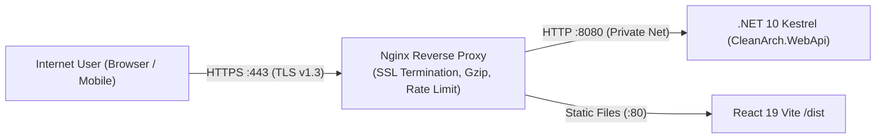

# Module 02: Reverse Proxy with Nginx & SSL/TLS Configuration

In production environments, web applications are rarely exposed directly to the public internet via Kestrel. Instead, an industry-standard **Reverse Proxy** such as **Nginx** handles TLS termination, request throttling, HTTP compression, and proxying.

---

## 🛡️ 1. Why Place Nginx in Front of Kestrel?



Key benefits of Nginx as a reverse proxy:

1. **SSL/TLS Termination**: Nginx decrypts incoming HTTPS traffic, offloading CPU cryptographic load from Kestrel.
2. **Port Multiplexing**: Host frontend, backend API, and administrative endpoints on standard ports `80` and `443` on a single IP.
3. **DDoS & Rate Limiting**: Block abusive IP addresses before requests reach your .NET CLR runtime.
4. **Static Asset Caching & Gzip**: High-throughput file transfer using OS-level `sendfile`.
5. **Zero-Downtime Reloads**: Reload routing rules and certificates (`nginx -s reload`) without dropping active connections.

---

## ⚙️ 2. Production `nginx.conf` Configuration

Below is a complete, battle-tested Nginx configuration for your domain (e.g., `cleanarch.example.com`):

```nginx
# ==============================================================================
# Global Rate Limiting Zone (10 requests/second per client IP)
# ==============================================================================
limit_req_zone $binary_remote_addr zone=api_limit:10m rate=10r/s;

# Upstream pool with keepalive connections for optimal latency
upstream cleanarch_backend {
    server 127.0.0.1:8080;
    keepalive 32;
}

# ==============================================================================
# Server Block: HTTP -> Redirect All to HTTPS
# ==============================================================================
server {
    listen 80;
    listen [::]:80;
    server_name cleanarch.example.com;

    # Allow Let's Encrypt ACME challenge verification over HTTP
    location /.well-known/acme-challenge/ {
        root /var/www/certbot;
    }

    location / {
        return 301 https://$host$request_uri;
    }
}

# ==============================================================================
# Server Block: HTTPS Main Application
# ==============================================================================
server {
    listen 443 ssl http2;
    listen [::]:443 ssl http2;
    server_name cleanarch.example.com;

    # SSL Certificates (Let's Encrypt / Certbot)
    ssl_certificate /etc/letsencrypt/live/cleanarch.example.com/fullchain.pem;
    ssl_certificate_key /etc/letsencrypt/live/cleanarch.example.com/privkey.pem;

    # Modern TLS Security Protocols & Ciphers
    ssl_protocols TLSv1.2 TLSv1.3;
    ssl_ciphers ECDHE-ECDSA-AES128-GCM-SHA256:ECDHE-RSA-AES128-GCM-SHA256:ECDHE-ECDSA-AES256-GCM-SHA384:ECDHE-RSA-AES256-GCM-SHA384;
    ssl_prefer_server_ciphers off;
    ssl_session_timeout 1d;
    ssl_session_cache shared:SSL:10m;
    ssl_session_tickets off;
    ssl_stapling on;
    ssl_stapling_verify on;

    # Security Headers
    add_header X-Frame-Options "DENY" always;
    add_header X-Content-Type-Options "nosniff" always;
    add_header X-XSS-Protection "1; mode=block" always;
    add_header Referrer-Policy "strict-origin-when-cross-origin" always;
    add_header Strict-Transport-Security "max-age=63072000; includeSubDomains; preload" always;

    # Compression
    gzip on;
    gzip_vary on;
    gzip_min_length 1024;
    gzip_proxied expired no-cache no-store private auth;
    gzip_types text/plain text/css text/xml text/javascript application/x-javascript application/xml application/json;

    # Client Request Body Limit (for file uploads like Excel imports)
    client_max_body_size 25M;

    # --------------------------------------------------------------------------
    # 1. API Reverse Proxy -> Forward to .NET 10 WebAPI
    # --------------------------------------------------------------------------
    location /api/ {
        # Apply Rate Limiting (burst of 20 with no delay)
        limit_req zone=api_limit burst=20 nodelay;

        proxy_pass http://cleanarch_backend;
        proxy_http_version 1.1;

        # Standard Forwarding Headers
        proxy_set_header Connection "";
        proxy_set_header Host $host;
        proxy_set_header X-Real-IP $remote_addr;
        proxy_set_header X-Forwarded-For $proxy_add_x_forwarded_for;
        proxy_set_header X-Forwarded-Proto $scheme;
        proxy_set_header X-Forwarded-Host $host;
        proxy_set_header X-Forwarded-Port $server_port;

        # Timeouts
        proxy_connect_timeout 60s;
        proxy_send_timeout 60s;
        proxy_read_timeout 60s;
    }

    # --------------------------------------------------------------------------
    # 2. Frontend SPA -> Serve React 19 Dist
    # --------------------------------------------------------------------------
    location / {
        root /var/www/cleanarch-client/dist;
        index index.html;
        try_files $uri $uri/ /index.html;
    }

    # Cache static assets
    location ~* \.(?:ico|css|js|gif|jpe?g|png|woff2?|eot|otf|ttf|svg)$ {
        root /var/www/cleanarch-client/dist;
        expires 6M;
        access_log off;
        add_header Cache-Control "public, max-age=15552000, immutable";
    }
}
```

---

## 🔒 3. Configuring Forwarded Headers in ASP.NET Core

Because Nginx terminates TLS and forwards requests over plain HTTP (`http://127.0.0.1:8080`), ASP.NET Core needs `ForwardedHeadersMiddleware` to correctly discover client IP addresses, HTTPS schemes, and hostnames for JWT token generation and redirect policies.

In `src/CleanArch.WebApi/Program.cs`:

```csharp
using Microsoft.AspNetCore.HttpOverrides;

var builder = WebApplication.CreateBuilder(args);

// Configure Forwarded Headers for Reverse Proxy (Nginx / Cloudflare / Traefik)
builder.Services.Configure<ForwardedHeadersOptions>(options =>
{
    options.ForwardedHeaders = ForwardedHeaders.XForwardedFor | ForwardedHeaders.XForwardedProto | ForwardedHeaders.XForwardedHost;
    // Clear default loopback network restriction if behind a container network
    options.KnownNetworks.Clear();
    options.KnownProxies.Clear();
});

var app = builder.Build();

// Must be placed at the very top of the middleware pipeline!
app.UseForwardedHeaders();

app.UseAuthentication();
app.UseAuthorization();
app.MapControllers();

app.Run();
```

---

## 📜 4. Free Automated SSL with Let's Encrypt & Certbot

### Step 1: Install Certbot on Ubuntu Server

```bash
sudo apt update
sudo apt install -y certbot python3-certbot-nginx
```

### Step 2: Generate and Auto-Configure Certificate

```bash
sudo certbot --nginx -d cleanarch.example.com
```

### Step 3: Verify Automated Certificate Renewal

Certbot installs a systemd timer that checks renewal twice daily:

```bash
sudo certbot renew --dry-run
```
