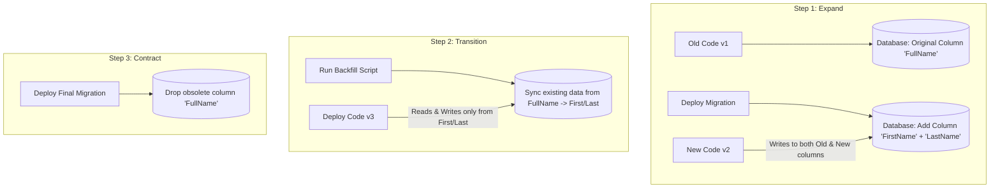

# Module 06: Production Database Migrations & Pre-Flight Readiness

Deploying updates to production requires careful handling of **database schema changes, secrets management, health checks, and backup automation** to ensure zero data loss and high availability.

---

## 🗄️ 1. Production Database Migration Strategies

### ⚠️ The Anti-Pattern: `dbContext.Database.Migrate()` on App Startup

Running migrations inside `Program.cs` during application startup (`app.Services.CreateScope()...Migrate()`) causes severe production outages when:

- **Multiple Replicas**: If 3 container replicas boot simultaneously, they attempt concurrent schema updates, leading to table locks, deadlocks, or partial migrations.
- **Excessive Database Permissions**: The web application's database user must be granted dangerous DDL permissions (`ALTER TABLE`, `DROP TABLE`) instead of standard DML (`SELECT`, `INSERT`, `UPDATE`, `DELETE`).

---

### ✅ Best Practice 1: EF Core Migration Bundles (Self-Contained Executable)

EF Core can compile migrations into a single, standalone binary that executes against your production database during your CI/CD deployment step:

```bash
# Generate the standalone bundle executable
dotnet ef migrations bundle \
  --project src/CleanArch.Infrastructure \
  --startup-project src/CleanArch.WebApi \
  --output ./efbundle \
  --configuration Release \
  --self-contained -r linux-x64
```

Execute in your deployment pipeline before rolling out new containers:

```bash
./efbundle --connection "Host=production-db;Database=clean_db;Username=admin;Password=secret"
```

---

### 🔄 2. Zero-Downtime Migrations: The Expand / Contract Pattern

When performing non-breaking deployments with rolling updates (where old and new versions of the application run concurrently), use the **Expand and Contract** pattern:



---

## 🔑 3. Production Secrets Management

Never commit production passwords, connection strings, or JWT signing keys to source control.

### Configuration Hierarchy

1. **`appsettings.json`**: Base development settings and placeholder keys.
2. **Environment Variables**: Overrides settings in containerized and cloud environments.
   - For nested keys in Linux/Docker, use **double underscores (`__`)**:
     - `ConnectionStrings:DefaultConnection` ➔ `ConnectionStrings__DefaultConnection`
     - `Jwt:SecretKey` ➔ `Jwt__SecretKey`
3. **Cloud Key Vaults**: Azure Key Vault or AWS Secrets Manager for encrypted, auditable secret storage.

---

## 🩺 4. Health Checks & Probes

In `CleanArch.ServiceDefaults`, health checks are divided into two distinct endpoints:

| Endpoint | Probe Type | Purpose | Cloud Behavior |
| :--- | :--- | :--- | :--- |
| **`/alive`** | Liveness | Checks if the .NET process is responsive and not deadlocked. | If it fails, Kubernetes / Docker restarts the container. |
| **`/health`** | Readiness | Checks if database and external dependencies are online. | If it fails, traffic is diverted away from this container until it recovers. |

---

## 💾 5. Automated Database Backup Script (PostgreSQL)

Create `/opt/scripts/backup-db.sh` on your production host:

```bash
#!/bin/bash
set -e

BACKUP_DIR="/var/backups/cleanarch"
TIMESTAMP=$(date +"%Y%m%d_%H%M%S")
FILENAME="$BACKUP_DIR/db_backup_$TIMESTAMP.sql.gz"

mkdir -p "$BACKUP_DIR"

# Dump database through docker container and compress
docker exec -t cleanarch_postgres pg_dump -U clean_user clean_identity_db | gzip > "$FILENAME"

# Delete backups older than 14 days
find "$BACKUP_DIR" -type f -name "*.sql.gz" -mtime +14 -delete

echo "[$(date)] Backup completed successfully: $FILENAME"
```

Set up automated daily execution with cron (`crontab -e`):

```cron
0 2 * * * /opt/scripts/backup-db.sh >> /var/log/db_backup.log 2>&1
```

---

## 📋 6. Production Pre-Flight Checklist

- [ ] **HTTPS Enforced**: All HTTP requests redirect to HTTPS (`301 Moved Permanently`).
- [ ] **CORS Restricted**: Allowed origins explicitly set to production domains (no wildcard `*` with credentials).
- [ ] **Secure JWT**: Key is 256-bit+ (64+ characters) and stored in environment secrets.
- [ ] **Logging Configured**: Structured logging with file retention limits and log level set to `Information` or `Warning`.
- [ ] **Rate Limiting Active**: Action filters or Nginx throttling prevent brute-force attacks on `/api/auth/login`.
- [ ] **Database Backups Scheduled**: Daily backups with retention policy and tested restoration plan.
