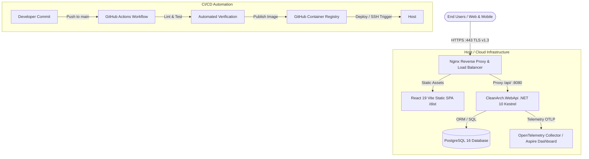

# .NET 10 & React 19 Deployment, Docker, Nginx & DevOps Learning Path

Welcome to the comprehensive deployment, DevOps, and infrastructure guide for the **Clean Architecture .NET 10 & React 19 Enterprise Stack**. This documentation covers everything required to take your application from a local workstation to a high-availability, secure production deployment.

---

## 🏛️ End-to-End Production Deployment Topology



---

## 📚 Deployment & DevOps Curriculum Modules

1. [**01 - Docker & Containerization for .NET 10 & React 19**](file:///C:/Users/Hoang/Desktop/clean/docs-deploy/01-docker-and-containerization.md)
   - Multi-stage .NET 10 Web API Dockerfile with non-root security (`USER app`)
   - React 19 + Vite + Tailwind CSS static build containerization (Nginx Alpine)
   - Unified `docker-compose.yml` (PostgreSQL, Backend API, Frontend SPA)
   - Docker layer caching optimizations and `.dockerignore` best practices

2. [**02 - Reverse Proxy with Nginx & SSL/TLS Configuration**](file:///C:/Users/Hoang/Desktop/clean/docs-deploy/02-reverse-proxy-nginx-and-ssl.md)
   - Production-grade `nginx.conf` with rate limiting, Gzip compression & security headers
   - Single Page Application (SPA) client routing fallback (`try_files`)
   - Configuring ASP.NET Core `UseForwardedHeaders` middleware
   - Free automated SSL/TLS certificates with Let's Encrypt & Certbot

3. [**03 - CI/CD Pipelines with GitHub Actions**](file:///C:/Users/Hoang/Desktop/clean/docs-deploy/03-ci-cd-github-actions-pipelines.md)
   - Continuous Integration (CI): Code formatting (`dotnet format`), linting (`oxlint`), and test coverage
   - Continuous Deployment (CD): Building and publishing multi-arch images to GitHub Container Registry (GHCR)
   - Automated zero-downtime deployment triggers over SSH
   - Production secrets governance and GitHub Environment protection rules

4. [**04 - Cloud Hosting & VPS Production Deployment**](file:///C:/Users/Hoang/Desktop/clean/docs-deploy/04-cloud-hosting-and-vps-deployment.md)
   - IaaS (VPS) vs PaaS (Azure App Service) vs Serverless Containers (Azure Container Apps)
   - Hardening Ubuntu 24.04 LTS (Dedicated user, SSH keys, UFW Firewall, Fail2Ban)
   - Preventing disk space exhaustion with Docker log rotation (`daemon.json`)
   - Managing application lifecycle with Linux `systemd` services

5. [**05 - .NET Aspire & Azure Container Apps (Cloud-Native Deployment)**](file:///C:/Users/Hoang/Desktop/clean/docs-deploy/05-dotnet-aspire-and-azure-container-apps.md)
   - How `CleanArch.AppHost` acts as an Infrastructure-as-Code topology manifest
   - Cloud deployment via Azure Developer CLI (`azd up`)
   - Exporting Aspire graphs to Kubernetes & Helm charts using **Aspirate** (`aspirate`)
   - Telemetry ingestion in cloud environments (Azure Log Analytics / Prometheus)

6. [**06 - Production Database Migrations & Pre-Flight Readiness**](file:///C:/Users/Hoang/Desktop/clean/docs-deploy/06-database-migrations-and-production-readiness.md)
   - Why `dbContext.Database.Migrate()` on startup is dangerous in multi-replica environments
   - Standalone EF Core Migration Bundles (`dotnet ef migrations bundle`) in CI/CD
   - Zero-downtime database updates with the **Expand / Contract** pattern
   - Liveness (`/alive`) vs Readiness (`/health`) probes and automated daily backup scripts

7. [**07 - Top 30 DevOps, Docker & Cloud Deployment Interview Questions**](file:///C:/Users/Hoang/Desktop/clean/docs-deploy/07-top-30-devops-and-deployment-interview-questions.md)
   - 🟢 **10 Easy/Foundational Questions**: Containers vs VMs, Multi-stage builds, `.dockerignore`, `CMD` vs `ENTRYPOINT`, Reverse Proxying
   - 🟡 **10 Medium/Intermediate Questions**: Startup migrations vs Bundles, Layer caching, Forwarded headers, Blue/Green vs Rolling, SPA Nginx routing
   - 🔴 **10 Advanced/Senior Questions**: Expand & Contract schema migrations, Rootless container security, TLS 1.3 handshakes, Distributed tracing propagation, RPO/RTO backup strategies

---

## ⚡ Quick Deployment Cheat Sheet

```bash
# 1. Build and start full stack in detached mode
docker compose up -d --build

# 2. Check running container status and health
docker compose ps

# 3. View live backend logs
docker compose logs -f api

# 4. Generate standalone EF Core migration bundle
dotnet ef migrations bundle --project src/CleanArch.Infrastructure --startup-project src/CleanArch.WebApi --output ./efbundle

# 5. Deploy entire Aspire cloud stack to Azure
azd up
```
