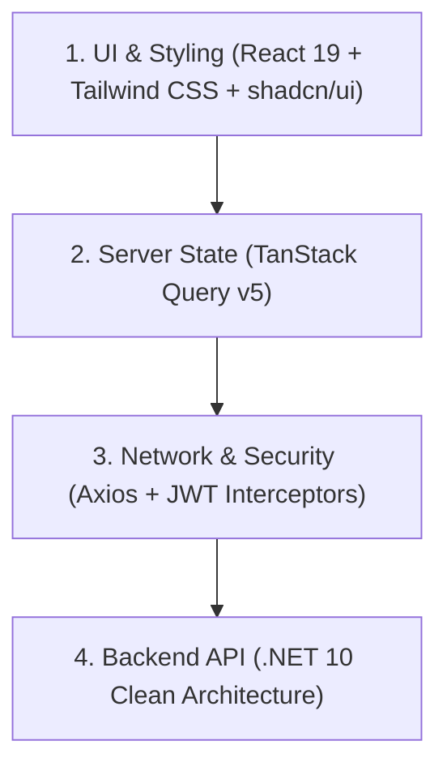

# 01 - React 19 & Modern Frontend Tech Stack Overview

## 1. Overview of the Modern Frontend Stack

In modern enterprise applications, the frontend is not just a UI layer—it manages server state, complex caching, token rotation, design systems, and resilient network communication.



---

## 2. The 5 Core Pillars of Our Frontend Stack

| Technology | Role & Purpose | Key Highlights |
| :--- | :--- | :--- |
| **React 19** | Modern UI Framework | Actions, `useActionState`, `useOptimistic`, improved hydration & compiler optimizations. |
| **Tailwind CSS v4** | Utility-first CSS Engine | Zero-config CSS variables, lightning-fast compilation with `@tailwindcss/vite`. |
| **shadcn/ui** | Accessible Component Primitives | Radix UI accessible foundation, `class-variance-authority` (cva), `cn()` class merging. |
| **Axios** | HTTP Client & Security Interceptor | Automatic Bearer token attachment, Correlation ID injection, and **Automatic 401 Refresh Token Rotation**. |
| **TanStack Query v5** | Server State Management & Caching | Declarative fetching (`useQuery`), mutation lifecycle (`useMutation`), automatic background refetching, and cache invalidation (`queryClient.invalidateQueries`). |

---

## 3. Frontend Architecture

Our frontend code lives in [`client/src/`](file:///C:/Users/Hoang/Desktop/clean/client/src/):

```text
client/src/
├── api/
│   └── axiosClient.ts       # Axios instance with request/response interceptors
│
├── components/
│   └── ui/                  # Reusable shadcn component primitives
│       ├── button.tsx       # Button with variants (default, destructive, outline, success)
│       ├── card.tsx         # Card, CardHeader, CardTitle, CardContent
│       ├── badge.tsx        # Status and role badges
│       └── input.tsx        # Styled input fields
│
├── features/                # Feature-based modular structure
│   ├── auth/                # Identity login, role inspection & token refresh UI
│   ├── products/            # Catalog, TanStack caching, and EPPlus Excel export/import
│   └── payments/            # Payments with Idempotency-Key testing
│
├── lib/
│   └── utils.ts             # cn() utility helper (clsx + tailwind-merge)
│
├── App.tsx                  # Main application with QueryClientProvider & navigation
├── index.css                # Tailwind CSS v4 root stylesheet
└── main.tsx                 # React 19 entry point
```

---

## 4. How to Run the Frontend

In your terminal:

```powershell
cd client
npm run dev
```

Open your browser at:

```text
http://localhost:3000
```

*(Vite proxies all `/api/*` calls automatically to the .NET 10 backend at `http://localhost:5000`)*.
