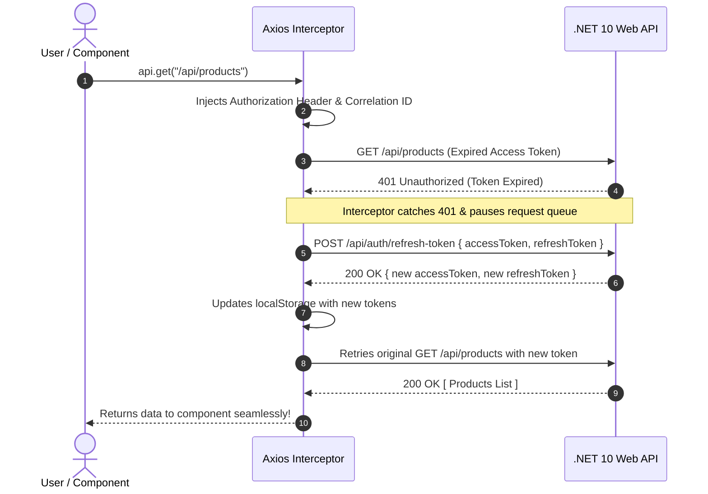

# 03 - Axios Interceptors, Bearer Tokens & 401 Refresh Token Rotation

## 1. Why Axios Interceptors?

In a secured Single Page Application (SPA), manually attaching `Authorization: Bearer <token>` to every `fetch()` call and handling expired tokens in every component leads to code duplication and race conditions.

**Axios Interceptors** act as global middleware for HTTP requests and responses:
1. **Request Interceptor**: Injects `Authorization: Bearer <accessToken>` and `X-Correlation-ID: WEB-<UUID>` automatically before any request leaves the browser.
2. **Response Interceptor**: Automatically catches `401 Unauthorized` errors, calls the backend refresh endpoint (`/api/auth/refresh-token`), updates `localStorage`, and retries the original request seamlessly without user disruption!



---

## 2. Implementation in `axiosClient.ts`

In [axiosClient.ts](file:///C:/Users/Hoang/Desktop/clean/client/src/api/axiosClient.ts):

```typescript
import axios, { AxiosError, type InternalAxiosRequestConfig } from 'axios'

export const api = axios.create({
  baseURL: 'http://localhost:5000',
  headers: { 'Content-Type': 'application/json' },
})

// 1. REQUEST INTERCEPTOR: Inject Bearer Token & Correlation ID
api.interceptors.request.use((config: InternalAxiosRequestConfig) => {
  const token = localStorage.getItem('accessToken')
  if (token && config.headers) {
    config.headers.Authorization = `Bearer ${token}`
  }

  // Attach Correlation ID for distributed tracing
  if (config.headers && !config.headers['X-Correlation-ID']) {
    config.headers['X-Correlation-ID'] = `WEB-${crypto.randomUUID()}`
  }

  return config
})

// 2. RESPONSE INTERCEPTOR: Automatic Refresh Token Rotation on 401
let isRefreshing = false
let failedQueue: Array<{ resolve: (val?: unknown) => void; reject: (err?: unknown) => void }> = []

const processQueue = (error: Error | null) => {
  failedQueue.forEach((prom) => (error ? prom.reject(error) : prom.resolve()))
  failedQueue = []
}

api.interceptors.response.use(
  (response) => response,
  async (error: AxiosError) => {
    const originalRequest = error.config as InternalAxiosRequestConfig & { _retry?: boolean }

    if (error.response?.status === 401 && originalRequest && !originalRequest._retry) {
      if (originalRequest.url?.includes('/api/auth/login') || originalRequest.url?.includes('/api/auth/refresh-token')) {
        return Promise.reject(error)
      }

      if (isRefreshing) {
        return new Promise((resolve, reject) => {
          failedQueue.push({ resolve, reject })
        }).then(() => api(originalRequest)).catch((err) => Promise.reject(err))
      }

      originalRequest._retry = true
      isRefreshing = true

      const accessToken = localStorage.getItem('accessToken')
      const refreshToken = localStorage.getItem('refreshToken')

      if (!refreshToken) {
        localStorage.clear()
        window.location.href = '/'
        return Promise.reject(error)
      }

      try {
        const { data } = await axios.post('http://localhost:5000/api/auth/refresh-token', {
          accessToken,
          refreshToken,
        })

        if (data.succeeded && data.data) {
          localStorage.setItem('accessToken', data.data.accessToken)
          localStorage.setItem('refreshToken', data.data.refreshToken)

          if (originalRequest.headers) {
            originalRequest.headers.Authorization = `Bearer ${data.data.accessToken}`
          }

          processQueue(null)
          return api(originalRequest)
        } else {
          throw new Error('Refresh failed')
        }
      } catch (refreshErr) {
        processQueue(refreshErr as Error)
        localStorage.clear()
        window.location.href = '/'
        return Promise.reject(refreshErr)
      } finally {
        isRefreshing = false
      }
    }

    return Promise.reject(error)
  }
)
```
