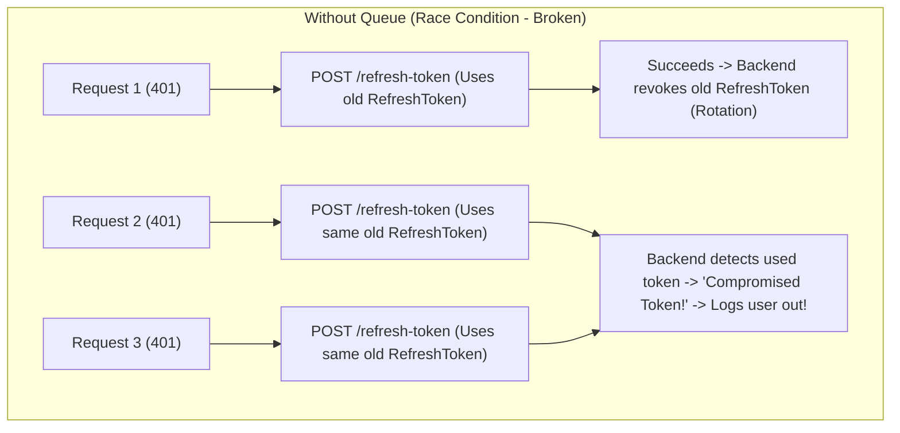
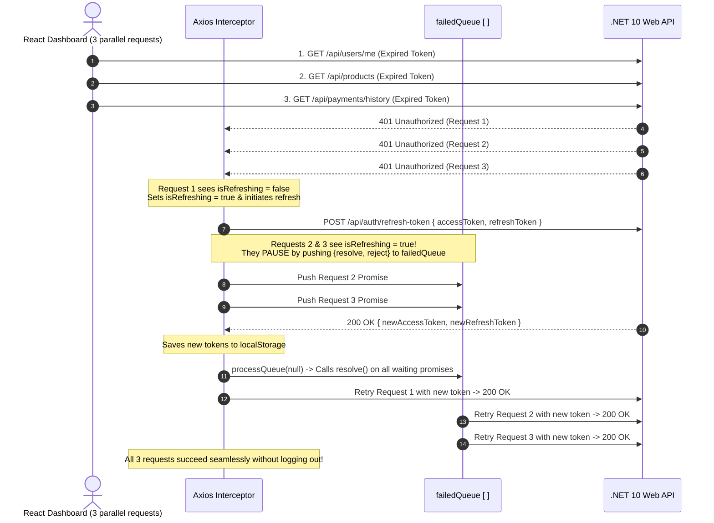

# 03 - Axios Interceptors, Bearer Tokens & 401 Refresh Token Rotation

## 1. Why Axios Interceptors in Enterprise SPAs?

In a secured Single Page Application (SPA), manually attaching `Authorization: Bearer <token>` to every HTTP call and handling token expiration in every component causes massive code duplication, subtle bugs, and security risks.

**Axios Interceptors** act as global middleware for outgoing HTTP requests and incoming HTTP responses:
1. **Request Interceptor**: Injects `Authorization: Bearer <accessToken>` and `X-Correlation-ID: WEB-<UUID>` automatically before any request leaves the browser.
2. **Response Interceptor**: Catches `401 Unauthorized` errors, pauses subsequent network traffic, calls the backend refresh endpoint (`/api/auth/refresh-token`), updates token storage, and retries all waiting requests seamlessly without user disruption!

---

## 2. The Core Challenge: The "Concurrent 401 Stampede" Race Condition

When a user opens a dashboard with multiple widgets, the browser often fires **3 to 5 API calls in parallel**:
1. `GET /api/users/me`
2. `GET /api/products`
3. `GET /api/payments/history`

If the user's Access Token expired 10 seconds ago, **all 3 requests fail with `401 Unauthorized` simultaneously**.



### Why does this fail without queueing?
In **Single-Use Refresh Token Rotation** (which our .NET 10 backend enforces), a refresh token can only be used **once**. As soon as Request 1 refreshes the token, the backend invalidates it. When Request 2 arrives 2 milliseconds later with the old token, the backend treats it as a **replay attack / stolen token attempt** and revokes the user's entire session, logging them out!

---

## 3. The Architecture: The Queueing & Pausing Pattern

To solve this concurrency problem, we implement a **Promise-based Queue**:
1. The **first** 401 request sets `isRefreshing = true` and fires the single `POST /api/auth/refresh-token` call.
2. Any **subsequent** 401 requests that arrive while `isRefreshing === true` are **put on hold (paused)** by pushing their `resolve` / `reject` handles into a `failedQueue` array.
3. Once the token refresh succeeds, we update `localStorage`, drain the queue by calling `resolve()` on all waiting promises, and automatically retry every request with the fresh Access Token.



---

## 4. Deep-Dive Code Breakdown: `client/src/api/axiosClient.ts`

Here is the complete implementation and the detailed explanation of each part:

```typescript
import axios, { AxiosError, type InternalAxiosRequestConfig } from 'axios'

// 1. Create Base Axios Instance
export const api = axios.create({
  baseURL: 'http://localhost:5000',
  headers: {
    'Content-Type': 'application/json',
  },
})

// 2. Request Interceptor: Attach Token & Correlation ID
api.interceptors.request.use((config: InternalAxiosRequestConfig) => {
  const token = localStorage.getItem('accessToken')
  if (token && config.headers) {
    config.headers.Authorization = `Bearer ${token}`
  }

  // Attach Correlation ID for distributed tracing with Serilog
  if (config.headers && !config.headers['X-Correlation-ID']) {
    config.headers['X-Correlation-ID'] = `WEB-${crypto.randomUUID()}`
  }

  return config
})

// 3. Concurrency Control State
let isRefreshing = false
let failedQueue: Array<{
  resolve: (value?: unknown) => void
  reject: (reason?: unknown) => void
}> = []

const processQueue = (error: Error | null) => {
  failedQueue.forEach((prom) => {
    if (error) {
      prom.reject(error)
    } else {
      prom.resolve()
    }
  })
  failedQueue = []
}

// 4. Response Interceptor: 401 Handling & Refresh Logic
api.interceptors.response.use(
  (response) => response,
  async (error: AxiosError) => {
    const originalRequest = error.config as InternalAxiosRequestConfig & { _retry?: boolean }

    // If 401 Unauthorized and not already retried
    if (error.response?.status === 401 && originalRequest && !originalRequest._retry) {
      // Avoid infinite loops if auth endpoints themselves return 401
      if (
        originalRequest.url?.includes('/api/auth/login') ||
        originalRequest.url?.includes('/api/auth/refresh-token')
      ) {
        return Promise.reject(error)
      }

      // =========================================================================
      // 🌟 THE PAUSE & QUEUE MECHANISM (Detailed Explanation below)
      // =========================================================================
      if (isRefreshing) {
        return new Promise((resolve, reject) => {
          failedQueue.push({ resolve, reject })
        })
          .then(() => api(originalRequest))
          .catch((err) => Promise.reject(err))
      }

      originalRequest._retry = true
      isRefreshing = true

      const accessToken = localStorage.getItem('accessToken')
      const refreshToken = localStorage.getItem('refreshToken')

      // If no refresh token exists, session cannot be refreshed
      if (!refreshToken) {
        localStorage.clear()
        window.location.href = '/'
        return Promise.reject(error)
      }

      try {
        // Use raw axios to prevent triggering the interceptor again
        const { data } = await axios.post('http://localhost:5000/api/auth/refresh-token', {
          accessToken,
          refreshToken,
        })

        if (data.succeeded && data.data) {
          // Store the newly rotated tokens
          localStorage.setItem('accessToken', data.data.accessToken)
          localStorage.setItem('refreshToken', data.data.refreshToken)

          // Update header of the current request
          if (originalRequest.headers) {
            originalRequest.headers.Authorization = `Bearer ${data.data.accessToken}`
          }

          // Drain and resolve all paused requests in the queue
          processQueue(null)

          // Retry the original first request
          return api(originalRequest)
        } else {
          throw new Error('Refresh failed')
        }
      } catch (refreshErr) {
        // Refresh token is expired/revoked: reject all queued requests and force login
        processQueue(refreshErr as Error)
        localStorage.clear()
        window.location.href = '/'
        return Promise.reject(refreshErr)
      } finally {
        isRefreshing = false
      }
    }

    return Promise.reject(error)
  }
)
```

---

## 5. Line-by-Line Breakdown of the Queueing Block

Let's dissect the exact piece of code:

```typescript
if (isRefreshing) {
  return new Promise((resolve, reject) => {
    failedQueue.push({ resolve, reject })
  })
    .then(() => api(originalRequest))
    .catch((err) => Promise.reject(err))
}
```

### 1. `return new Promise((resolve, reject) => { ... })`
- When you construct `new Promise((resolve, reject) => {})` without immediately invoking `resolve()` or `reject()`, the Promise enters a **`pending` (paused) state**.
- Returning this pending Promise halts the execution of that specific Axios request. Axios will not resolve or fail the component's `useQuery` call yet—it simply waits.

### 2. `failedQueue.push({ resolve, reject })`
- JavaScript functions are first-class objects. We save the `resolve` and `reject` callbacks into our `failedQueue` array:
  ```typescript
  let failedQueue: Array<{
    resolve: (value?: unknown) => void
    reject: (reason?: unknown) => void
  }> = []
  ```
- This gives us a reference to "wake up" this paused Promise whenever we want from outside the Promise constructor!

### 3. Waking Up via `processQueue(null)`
- When the first request finishes refreshing the token, it invokes:
  ```typescript
  const processQueue = (error: Error | null) => {
    failedQueue.forEach((prom) => {
      if (error) {
        prom.reject(error)
      } else {
        prom.resolve() // 👈 THIS WAKES UP EVERY PAUSED PROMISE!
      }
    })
    failedQueue = []
  }
  ```
- Calling `prom.resolve()` transitions the Promise from `pending` to `fulfilled`.

### 4. `.then(() => api(originalRequest))`
- As soon as the Promise fulfills, this `.then()` callback fires.
- It calls `api(originalRequest)` to re-dispatch the exact same HTTP call.
- Because `localStorage` now contains the **new Access Token**, our **Request Interceptor** automatically grabs the new token, injects it into `Authorization: Bearer <new_token>`, and the request succeeds with `200 OK`!

### 5. `.catch((err) => Promise.reject(err))`
- If the token refresh fails (e.g. Refresh Token was revoked or expired past 7 days), `processQueue(refreshErr)` calls `prom.reject(error)`.
- This ensures all waiting components receive the error cleanly without hanging indefinitely.

---

## 6. Critical Edge Cases & Protections

| Edge Case | How We Protect Against It |
| :--- | :--- |
| **Infinite Retry Loop** | `originalRequest._retry = true` ensures each request can only be retried once. If it fails a second time, it immediately throws. |
| **Auth Endpoint 401s** | If `/api/auth/login` or `/api/auth/refresh-token` fails with 401, we skip refresh logic (`url?.includes('/api/auth/...')`) to prevent looping. |
| **Raw Axios Call for Refresh** | We use `axios.post(...)` instead of `api.post(...)` for the refresh call so that the refresh request itself does not pass through the interceptor. |
| **Expired Refresh Token** | When the refresh token expires, `try/catch` catches the error, clears `localStorage`, and executes `window.location.href = '/'` to redirect the user to login. |
