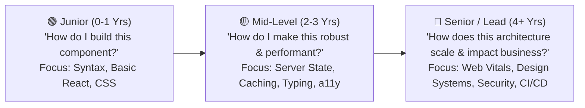

# 07 - Career & Technical Roadmap for a Modern Frontend Developer

This roadmap outlines the journey from **Junior (0–1 years)** to **Mid-Level (2–3 years)** and **Senior / Staff Frontend Engineer (4+ years)** in modern web engineering using **React 19, TypeScript, TanStack Query, Tailwind CSS, and Cloud-Native architectures**.

---

## 🧭 1. The Junior ➔ Mid ➔ Senior Mindset Shift

| Trait | Junior Developer | Mid-Level Developer | Senior / Lead Engineer |
| :--- | :--- | :--- | :--- |
| **Component Design** | Monolithic components with messy `useEffect` hooks. | Clean, reusable components with custom hooks and shadcn primitives. | Scalable Design System, composable compound components, headless UI architecture. |
| **State Management** | Stores everything in global state or local `useState`. | Separates **Server State** (TanStack Query) from **Client/UI State** (Zustand/Context). | Optimistic mutations, cache normalization, state machine modeling (XState). |
| **Performance** | Fixes lag only when obvious. | Profiles renders, avoids unnecessary re-renders, leverages code-splitting. | Targets **Core Web Vitals (INP, LCP, CLS)**, bundle budgeting, memory leak prevention. |
| **Security & Auth** | Stores plain tokens in `localStorage` without refresh logic. | Implements Axios interceptors for automatic JWT refresh token rotation. | Mitigates XSS/CSRF, enforces CSP headers, implements secure token storage strategies. |
| **Code Quality** | Writes code that just works. | Follows TypeScript strict mode, ESLint/Prettier, `.editorconfig`. | Mentors peers, designs CI/CD pipelines, writes automated unit and E2E tests. |

---

## 🏛️ 2. The 6 Core Knowledge Pillars for Frontend Mastery

### 1. JavaScript & TypeScript Runtime Internals
- **Event Loop**: Call stack, Web APIs, Microtask queue (`Promise`, `queueMicrotask`) vs. Macrotask queue (`setTimeout`, `setInterval`, I/O).
- **Memory Management**: Garbage collection (Mark-and-sweep), identifying and fixing closures and detached DOM node memory leaks.
- **TypeScript Strict Mode**: Generics, Discriminated Unions, Template Literal Types, Utility types (`ReturnType`, `Parameters`, `Extract`, `Omit`), type guards.

### 2. Modern React 19 & Architecture
- **React 19 Primitives**: Actions, `useActionState`, `useOptimistic`, `use()`, `useFormStatus`.
- **Reconciliation Engine**: React Fiber tree, double buffering, work-in-progress tree, diffing algorithm.
- **Concurrent React**: `useTransition`, `useDeferredValue` for non-blocking UI rendering during CPU-heavy operations.
- **Rendering Paradigms**: Single Page Applications (SPA) vs. Server-Side Rendering (SSR) vs. Static Site Generation (SSG) vs. React Server Components (RSC).

### 3. Server State & Network Resilience
- **TanStack Query (React Query v5)**: Stale-while-revalidate, query keys hierarchy, garbage collection vs. stale time, optimistic UI updates, mutation rollbacks.
- **Resilient HTTP Communication**: Axios request/response interceptors, 401 refresh token queueing, distributed tracing (`X-Correlation-ID`), backoff retries.
- **Real-Time Data**: WebSockets, Server-Sent Events (SSE), resilient auto-reconnect logic.

### 4. Web Performance & Core Web Vitals
- **LCP (Largest Contentful Paint)**: Resource preloading, critical CSS, modern image formats (WebP/AVIF), font display swap.
- **INP (Interaction to Next Paint)**: Yielding main thread with `scheduler.yield()`, debouncing, requestIdleCallback.
- **CLS (Cumulative Layout Shift)**: Dimension placeholders, skeleton loaders, aspect-ratio preservation.
- **Bundle Optimization**: Dynamic `import()`, route-based code-splitting, tree-shaking, bundle visualizer analysis.

### 5. Styling, Design Systems & Accessibility (a11y)
- **Modern CSS & Tailwind**: CSS variables, container queries, Tailwind CSS v4 engine.
- **Design System Architecture**: Headless primitives (Radix UI), `class-variance-authority` (cva), `clsx` + `tailwind-merge` (`cn()`).
- **WCAG 2.1 AA Compliance**: Semantic HTML5, ARIA roles, focus traps in modals, full keyboard navigation.

### 6. Security, Testing & DevOps
- **Security**: Cross-Site Scripting (XSS) defense, Content Security Policy (CSP), Cross-Site Request Forgery (CSRF), iframe sandboxing.
- **Testing Pyramid**: Unit & Component testing (Vitest, React Testing Library), End-to-End testing (Playwright).
- **CI/CD**: GitHub Actions, Dockerizing frontend with Nginx multi-stage builds.

---

## 🎯 3. Three Milestone Portfolio Projects

To demonstrate senior-level capability, build:

1. **Enterprise Design System & Component Library**:
   - Packaged with Storybook, automated accessibility auditing (`axe-core`), and full dark/light theme switching with Tailwind and CSS variables.
2. **Real-Time SaaS Dashboard (TanStack Query + WebSockets + Charts)**:
   - Live metrics streaming, optimistic data updates, complex filtering with URL query params, and Excel `.xlsx` report export/import.
3. **High-Performance E-Commerce Portal**:
   - Infinite scrolling with virtualized lists (`@tanstack/react-virtual`), zero layout shift (0 CLS), sub-1.5s LCP, and offline PWA capabilities.

---

## 📖 4. Recommended Books & Resources

- 📘 *You Don't Know JS Yet* by Kyle Simpson
- 📘 *Refactoring UI* by Adam Wathan & Steve Schoger
- 📘 *Learning TypeScript* by Josh Goldberg
- 🌐 [web.dev](https://web.dev) by Google Chrome Team (Core Web Vitals)
- 🌐 [tkdodo.eu/blog](https://tkdodo.eu/blog) (The definitive guide to TanStack Query by maintainer Dominik Dorfmeister)
