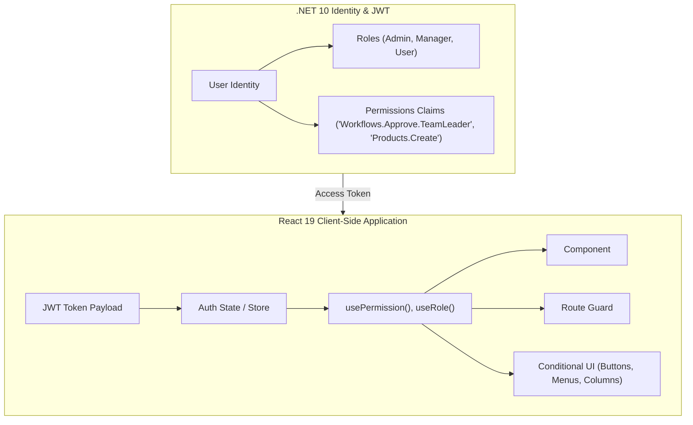
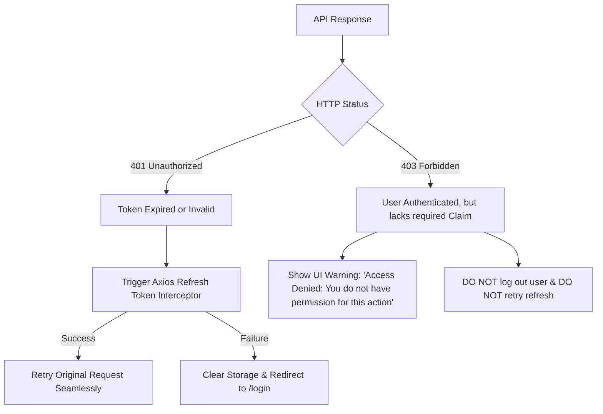

# 09 - Permission Handling, Dynamic Claim Policies & RBAC in React 19

In modern enterprise applications, authorization is far more nuanced than simple boolean checks like `isAdmin`. Enterprise systems require **Fine-Grained Claim-Based Access Control (CBAC)** and **Role-Based Access Control (RBAC)** where permissions are dynamically assigned to users and evaluated at runtime.

This guide details how to build a robust, reactive, and secure permission handling system in **React 19** and **TypeScript**, seamlessly integrated with our **.NET 10 Dynamic Authorization Policy Provider** (`[DynamicAuthorize]`).

---

## 1. Architectural Foundations: RBAC vs. CBAC



### Key Distinctions

| Feature | Role-Based Access Control (RBAC) | Claim/Permission-Based Access Control (CBAC) |
| :--- | :--- | :--- |
| **Granularity** | Coarse-grained (`Admin`, `Manager`, `Employee`). | Fine-grained (`Workflows.Approve.Level1`, `Reports.Export`). |
| **Coupling** | High: Code is tightly coupled to organizational titles. | Low: Code is coupled to *capabilities*, not job titles. |
| **Scalability** | Rigid: Adding new roles requires changing frontend conditional code. | Highly Extensible: Roles are simply bags of permissions assigned in the database. |
| **Zero-Trust Alignment** | Low: Often leads to over-privileged users. | High: Adheres strictly to the Principle of Least Privilege (PoLP). |

---

## 2. JWT Payload Anatomy & Permission Extraction

When a user logs in via `POST /api/auth/login`, the .NET 10 API returns a JWT containing user metadata, roles, and granular permission claims:

```json
{
  "succeeded": true,
  "data": {
    "userId": "usr_981247",
    "email": "manager@example.com",
    "fullName": "Jane Doe",
    "roles": ["Manager"],
    "permissions": [
      "Products.View",
      "Products.Create",
      "Workflows.View",
      "Workflows.Create",
      "Workflows.Submit",
      "Workflows.Approve.DepartmentHead"
    ],
    "accessToken": "eyJhbGciOiJIUzI1NiIsInR5cCI6IkpXVCJ9...",
    "refreshToken": "d8a17f..."
  }
}
```

### Storing & Hydrating Auth State

In [client/src/features/auth/AuthSection.tsx](../client/src/features/auth/AuthSection.tsx), tokens are persisted in `localStorage` while the user profile and active permissions are held in reactive React state.

```typescript
// Type definition for current authenticated session
export interface CurrentUser {
  userId: string
  email: string
  fullName: string
  roles: string[]
  permissions: string[]
  accessToken: string
  refreshToken: string
}
```

---

## 3. Reusable Authorization Hooks

To keep components declarative and clean, encapsulate permission checks inside dedicated custom hooks:

```typescript
// client/src/hooks/useAuthorization.ts
import { useAuth } from './useAuth'

export function useAuthorization() {
  const { currentUser } = useAuth()

  const hasPermission = (permission: string): boolean => {
    if (!currentUser?.permissions) return false
    return currentUser.permissions.includes(permission)
  }

  const hasAnyPermission = (permissions: string[]): boolean => {
    if (!currentUser?.permissions) return false
    return permissions.some((p) => currentUser.permissions.includes(p))
  }

  const hasAllPermissions = (permissions: string[]): boolean => {
    if (!currentUser?.permissions) return false
    return permissions.every((p) => currentUser.permissions.includes(p))
  }

  const hasRole = (role: string): boolean => {
    if (!currentUser?.roles) return false
    return currentUser.roles.includes(role)
  }

  const hasAnyRole = (roles: string[]): boolean => {
    if (!currentUser?.roles) return false
    return roles.some((r) => currentUser.roles.includes(r))
  }

  return {
    hasPermission,
    hasAnyPermission,
    hasAllPermissions,
    hasRole,
    hasAnyRole,
    isAuthenticated: !!currentUser,
    user: currentUser,
  }
}
```

---

## 4. Building Declarative Permission Gates (`<PermissionGate />`)

Instead of cluttering JSX with ternary operators (`hasPermission(...) ? <Button /> : null`), build a declarative `<PermissionGate />` wrapper:

```tsx
// client/src/components/auth/PermissionGate.tsx
import React, { ReactNode } from 'react'
import { useAuthorization } from '@/hooks/useAuthorization'

interface PermissionGateProps {
  permission?: string
  permissions?: string[]
  requireAll?: boolean
  role?: string
  roles?: string[]
  fallback?: ReactNode
  children: ReactNode
}

export const PermissionGate: React.FC<PermissionGateProps> = ({
  permission,
  permissions,
  requireAll = false,
  role,
  roles,
  fallback = null,
  children,
}) => {
  const { hasPermission, hasAnyPermission, hasAllPermissions, hasRole, hasAnyRole } = useAuthorization()

  let isAuthorized = true

  // Single permission check
  if (permission && !hasPermission(permission)) {
    isAuthorized = false
  }

  // Multi-permission check
  if (permissions && permissions.length > 0) {
    const passed = requireAll
      ? hasAllPermissions(permissions)
      : hasAnyPermission(permissions)
    if (!passed) isAuthorized = false
  }

  // Single role check
  if (role && !hasRole(role)) {
    isAuthorized = false
  }

  // Multi-role check
  if (roles && roles.length > 0) {
    if (!hasAnyRole(roles)) isAuthorized = false
  }

  if (!isAuthorized) {
    return <>{fallback}</>
  }

  return <>{children}</>
}
```

### Usage Examples in Feature Components

#### 1. Conditional Action Button

```tsx
<PermissionGate 
  permission="Products.Create" 
  fallback={<span className="text-xs text-slate-400 italic">Read-only mode</span>}
>
  <Button onClick={() => openCreateModal()}>
    <Plus className="w-4 h-4 mr-1" /> Add Product
  </Button>
</PermissionGate>
```

#### 2. Workflow Tier Approval Action

```tsx
<PermissionGate 
  permission={workflow.currentLevelRequiredPermission}
  fallback={
    <div className="p-3 bg-amber-50 border border-amber-200 rounded text-xs text-amber-800">
      You do not possess the required permission (<code>{workflow.currentLevelRequiredPermission}</code>) to approve this level.
    </div>
  }
>
  <Button onClick={handleApprove} className="bg-emerald-600 hover:bg-emerald-700">
    Approve Level {workflow.currentApprovalLevel}
  </Button>
</PermissionGate>
```

---

## 5. Route Protection & Navigation Guards

In React Router (v6/v7), protect pages and whole route sub-trees using an authorization guard component:

```tsx
// client/src/components/auth/ProtectedRoute.tsx
import React from 'react'
import { Navigate, Outlet, useLocation } from 'react-router-dom'
import { useAuthorization } from '@/hooks/useAuthorization'

interface ProtectedRouteProps {
  requiredPermission?: string
  requiredRole?: string
  redirectTo?: string
}

export const ProtectedRoute: React.FC<ProtectedRouteProps> = ({
  requiredPermission,
  requiredRole,
  redirectTo = '/unauthorized',
}) => {
  const { isAuthenticated, hasPermission, hasRole } = useAuthorization()
  const location = useLocation()

  if (!isAuthenticated) {
    return <Navigate to="/login" state={{ from: location }} replace />
  }

  if (requiredPermission && !hasPermission(requiredPermission)) {
    return <Navigate to={redirectTo} replace />
  }

  if (requiredRole && !hasRole(requiredRole)) {
    return <Navigate to={redirectTo} replace />
  }

  return <Outlet />
}
```

### Configuring Route Trees

```tsx
<Routes>
  {/* Public Routes */}
  <Route path="/login" element={<LoginPage />} />

  {/* Authenticated Routes */}
  <Route element={<ProtectedRoute />}>
    <Route path="/workflows" element={<WorkflowListPage />} />
    <Route path="/workflows/:id" element={<WorkflowDetailPage />} />
  </Route>

  {/* Admin/Manager Only: Template Management */}
  <Route element={<ProtectedRoute requiredPermission="Workflows.ManageTemplates" />}>
    <Route path="/workflow-templates/new" element={<CreateWorkflowTemplatePage />} />
  </Route>
  
  <Route path="/unauthorized" element={<UnauthorizedPage />} />
</Routes>
```

---

## 6. Handling `403 Forbidden` vs `401 Unauthorized` in Axios

It is vital to distinguish between authentication failure (`401`) and authorization denial (`403`):



### Axios Interceptor Handling for 403

In `client/src/api/axiosClient.ts`:

```typescript
api.interceptors.response.use(
  (response) => response,
  async (error: AxiosError) => {
    const status = error.response?.status

    // 403 Forbidden: Do NOT attempt token refresh; show notification
    if (status === 403) {
      console.warn('[RBAC] Action rejected: Insufficient permissions (403 Forbidden).')
      // Optional: Dispatch a global toast/alert notification
      window.dispatchEvent(new CustomEvent('app:forbidden', { 
        detail: { message: 'You do not have permission to perform this action.' } 
      }))
      return Promise.reject(error)
    }

    // 401 Unauthorized: Trigger token refresh logic...
    if (status === 401) {
      // ... (Refresh Token Rotation Queue)
    }

    return Promise.reject(error)
  }
)
```

---

## 7. Multi-Tab Session Synchronization

When a user switches roles, logs out, or refreshes tokens in one browser tab, other open tabs must stay in sync to prevent stale permission states.

```typescript
// client/src/hooks/useAuthSync.ts
import { useEffect } from 'react'
import { useQueryClient } from '@tanstack/react-query'

export function useAuthSync(onLogout: () => void, onRefresh: () => void) {
  const queryClient = useQueryClient()

  useEffect(() => {
    const handleStorageChange = (e: StorageEvent) => {
      if (e.key === 'accessToken') {
        if (!e.newValue) {
          // Token removed in another tab -> Logout here
          onLogout()
          queryClient.clear()
        } else {
          // Token refreshed in another tab -> Invalidate queries & re-sync
          onRefresh()
          queryClient.invalidateQueries()
        }
      }
    }

    window.addEventListener('storage', handleStorageChange)
    return () => window.removeEventListener('storage', handleStorageChange)
  }, [onLogout, onRefresh, queryClient])
}
```

---

## 8. Crucial Security Principle: Zero-Trust Defense-in-Depth

> [!IMPORTANT]
> **Client-side authorization is purely a User Experience (UX) optimization.**
> Hiding a button, disabling a menu, or guarding a React route stops accidental clicks, but **does not stop malicious users** from opening browser DevTools and executing raw HTTP `POST` requests.
>
> **The backend is the ultimate source of truth.** Every API endpoint must be protected with .NET 10 dynamic claim policies (`[DynamicAuthorize("Workflows.Approve.TeamLeader")]`), guaranteeing zero-trust enforcement at the server boundary.

---

## 9. Summary & Next Steps

With this reactive RBAC/CBAC architecture:

1. Permissions are loaded from JWT claims and kept in reactive state.
2. Custom hooks (`useAuthorization`) and declarative components (`<PermissionGate>`) eliminate boilerplate.
3. Routes are guarded with `<ProtectedRoute>`.
4. `401` triggers transparent token rotation while `403` provides clear access denial feedback.
5. All UI authorization directly mirrors our .NET 10 dynamic policy engine.

Next, explore how dynamic permissions power the **N-Level Extensible Workflow Engine**:
👉 [**10 - Extensible Workflow Engine, State Machines & UI Integration**](./10-workflow-engine-state-machine-and-ui-integration.md)
