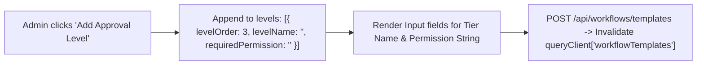

# 10 - Extensible Workflow Engine, State Machines & UI Integration in React 19

In enterprise applications, business workflows (purchase orders, vacation approvals, code releases, capital expenditure) require flexible, multi-tiered approval chains. Hardcoding workflow steps or fixed database enum statuses creates brittle UIs that require constant code rewrites whenever organizational policies change.

This document details the frontend implementation of our **Data-Driven $N$-Level Workflow Engine** in **React 19**, **Tailwind CSS**, **shadcn/ui**, and **TanStack Query v5**, designed to seamlessly integrate with our .NET 10 Clean Architecture backend.

---

## 1. Architectural Overview: Data-Driven vs Hardcoded Workflows

```mermaid
flowchart TD
    subgraph DataDrivenTemplate ["Dynamic Workflow Template (Database)"]
        T["WorkflowTemplate: 'Purchase Order Approval'"]
        T --> L1["Level 1: Team Leader (Workflows.Approve.TeamLeader)"]
        T --> L2["Level 2: Department Head (Workflows.Approve.DepartmentHead)"]
        T --> L3["Level 3: Technical Director (Workflows.Approve.TechnicalDirector)"]
    end

    subgraph RuntimeStateMachine ["Runtime State Machine (React UI & API)"]
        Draft(["Draft"]) -->|Submit Request| InApp1["InApproval (Level 1/3)"]
        InApp1 -->|Approve Level 1| InApp2["InApproval (Level 2/3)"]
        InApp2 -->|Approve Level 2| InApp3["InApproval (Level 3/3)"]
        InApp3 -->|Approve Level 3 (Final)| Approved(["Approved"])
        Approved -->|Complete| Completed(["Completed"])

        InApp1 -.->|Reject + Reason| Rejected(["Rejected"])
        InApp2 -.->|Reject + Reason| Rejected
        InApp3 -.->|Reject + Reason| Rejected

        Draft -.->|Mark Obsolete + Reason| Obsolete(["Obsolescence"])
        InApp1 -.->|Mark Obsolete + Reason| Obsolete
        InApp2 -.->|Mark Obsolete + Reason| Obsolete
        InApp3 -.->|Mark Obsolete + Reason| Obsolete
        Approved -.->|Mark Obsolete + Reason| Obsolete

        InApp1 ==>|Revoke Signatures & Reset to Draft| Draft
        InApp2 ==>|Revoke Signatures & Reset to Draft| Draft
        InApp3 ==>|Revoke Signatures & Reset to Draft| Draft
        Approved ==>|Revoke Signatures & Reset to Draft| Draft
        Rejected ==>|Revoke Signatures & Reset to Draft| Draft
    end
```

### Why Data-Driven Workflows Win

1. **Infinite Tier Flexibility**: The UI dynamically renders 1-step, 2-step, or $N$-step approval chains without any frontend component changes.
2. **Dynamic Permission Mapping**: Each approval tier specifies its own required claim (e.g. `Workflows.Approve.TechnicalDirector`). The UI checks the user's active claims before enabling the action.
3. **Complete Audit Trail**: Every action (Submitted, Approved, Rejected, Reset, Obsoleted) is stored in the database with timestamps and comments, rendered as an interactive visual timeline.
4. **Signature Revocation & Recovery**: If an error is detected mid-stream or after approval, authorized users can revoke all signatures and reset the workflow to `Draft` for requester corrections.

---

## 2. TypeScript Contracts & DTOs

In [client/src/features/workflows/types/workflow.ts](../client/src/features/workflows/types/workflow.ts), the contracts strictly mirror the .NET 10 Domain and Application models:

```typescript
export enum WorkflowStatus {
  Draft = 0,
  Submitted = 1,
  InApproval = 2,
  Rejected = 3,
  Approved = 4,
  Completed = 5,
  Obsolescence = 6,
}

export enum WorkflowActionType {
  Submitted = 0,
  Approved = 1,
  Rejected = 2,
  Completed = 3,
  MarkedObsolete = 4,
  ResetToDraft = 5,
}

export interface WorkflowApprovalLevelDto {
  id: number
  levelOrder: number
  levelName: string
  requiredPermission: string
}

export interface WorkflowTemplateDto {
  id: number
  name: string
  description: string
  isActive: boolean
  approvalLevels: WorkflowApprovalLevelDto[]
}

export interface WorkflowApprovalActionDto {
  id: number
  approvalLevel: number
  action: string
  actedByUserName: string
  comment?: string
  createdAtUtc: string
}

export interface WorkflowRequestDto {
  id: number
  title: string
  description: string
  requestedByUserName: string
  status: string
  currentApprovalLevel: number
  totalApprovalLevels: number
  currentLevelName?: string
  rejectionReason?: string
  obsolescenceReason?: string
  obsoletedByUserName?: string
  obsoletedAtUtc?: string
  approvedAtUtc?: string
  completedAtUtc?: string
  createdAtUtc: string
  workflowTemplateName: string
  history: WorkflowApprovalActionDto[]
}

export interface WorkflowRequestSummaryDto {
  id: number
  title: string
  status: string
  currentApprovalLevel: number
  totalApprovalLevels: number
  requestedByUserName: string
  workflowTemplateName: string
  createdAtUtc: string
}
```

---

## 3. TanStack Query v5 Server State & Mutations

In [client/src/features/workflows/hooks/useWorkflows.ts](../client/src/features/workflows/hooks/useWorkflows.ts), we maintain query key factories and mutation hooks that ensure **surgical cache invalidation**:

```typescript
import { useQuery, useMutation, useQueryClient } from '@tanstack/react-query'
import { workflowApi } from '../api/workflowApi'
import { WorkflowStatus } from '../types/workflow'

// Query Key Factory for Hierarchical Cache Invalidation
export const workflowKeys = {
  all: ['workflows'] as const,
  lists: () => [...workflowKeys.all, 'list'] as const,
  list: (status?: WorkflowStatus) => [...workflowKeys.lists(), { status }] as const,
  details: () => [...workflowKeys.all, 'detail'] as const,
  detail: (id: number) => [...workflowKeys.details(), id] as const,
  templates: ['workflowTemplates'] as const,
}

// 1. Query: List of Workflows with optional status filtering
export function useWorkflows(status?: WorkflowStatus) {
  return useQuery({
    queryKey: workflowKeys.list(status),
    queryFn: () => workflowApi.getWorkflows(status),
  })
}

// 2. Query: Workflow Detail with complete audit trail
export function useWorkflow(id: number) {
  return useQuery({
    queryKey: workflowKeys.detail(id),
    queryFn: () => workflowApi.getWorkflowById(id),
    enabled: !!id,
  })
}

// 3. Mutation: Approve Current Level
export function useApproveWorkflow() {
  const queryClient = useQueryClient()
  return useMutation({
    mutationFn: ({ id, comment }: { id: number; comment?: string }) =>
      workflowApi.approveWorkflow(id, comment),
    onSuccess: (data, variables) => {
      queryClient.invalidateQueries({ queryKey: workflowKeys.lists() })
      queryClient.invalidateQueries({ queryKey: workflowKeys.detail(variables.id) })
    },
  })
}

// 4. Mutation: Reject Workflow with Required Reason
export function useRejectWorkflow() {
  const queryClient = useQueryClient()
  return useMutation({
    mutationFn: ({ id, reason }: { id: number; reason: string }) =>
      workflowApi.rejectWorkflow(id, reason),
    onSuccess: (data, variables) => {
      queryClient.invalidateQueries({ queryKey: workflowKeys.lists() })
      queryClient.invalidateQueries({ queryKey: workflowKeys.detail(variables.id) })
    },
  })
}

// 5. Mutation: Revoke Signatures & Reset to Draft
export function useResetWorkflowToDraft() {
  const queryClient = useQueryClient()
  return useMutation({
    mutationFn: ({ id, reason }: { id: number; reason: string }) =>
      workflowApi.resetToDraft(id, reason),
    onSuccess: (data, variables) => {
      queryClient.invalidateQueries({ queryKey: workflowKeys.lists() })
      queryClient.invalidateQueries({ queryKey: workflowKeys.detail(variables.id) })
    },
  })
}
```

---

## 4. Visual Multi-Tier Stepper Component

The [WorkflowApprovalProgress.tsx](../client/src/features/workflows/components/WorkflowApprovalProgress.tsx) component visualizes an arbitrary $N$-tier approval chain. It dynamically renders:

- ✅ **Completed Steps**: Past approval tiers with green checkmark badges.
- ⏳ **Active Step**: Current tier under review with a pulsating yellow clock.
- 🔴 **Rejected Step**: Failed level rendered in red with alert styling.
- ⚪ **Pending Steps**: Future tiers grayed out.

```tsx
import { CheckCircle2, Circle, Clock } from 'lucide-react'

interface WorkflowApprovalProgressProps {
  currentApprovalLevel: number
  totalApprovalLevels: number
  status: string
}

export function WorkflowApprovalProgress({
  currentApprovalLevel,
  totalApprovalLevels,
  status,
}: WorkflowApprovalProgressProps) {
  const steps = Array.from({ length: totalApprovalLevels }, (_, i) => i + 1)
  const isRejected = status === 'Rejected'
  const isObsolete = status === 'Obsolescence'
  const isApprovedOrCompleted = status === 'Approved' || status === 'Completed'

  return (
    <div className="flex items-center gap-2">
      {steps.map((step) => {
        let isCompleted = false
        let isCurrent = false

        if (isApprovedOrCompleted) {
          isCompleted = true
        } else if (isRejected || isObsolete) {
          if (step < currentApprovalLevel) isCompleted = true
        } else {
          if (step < currentApprovalLevel) isCompleted = true
          if (step === currentApprovalLevel && status === 'InApproval') isCurrent = true
        }

        return (
          <div key={step} className="flex flex-col items-center gap-1">
            {isCompleted ? (
              <CheckCircle2 className="h-6 w-6 text-green-500" />
            ) : isCurrent ? (
              <Clock className="h-6 w-6 text-yellow-500" />
            ) : isRejected && step === currentApprovalLevel ? (
              <Circle className="h-6 w-6 text-red-500 fill-red-100" />
            ) : (
              <Circle className="h-6 w-6 text-slate-300" />
            )}
            <span className="text-[10px] font-medium text-slate-500">Level {step}</span>
          </div>
        )
      })}
    </div>
  )
}
```

---

## 5. Audit Trail & Interactive Timeline

The [WorkflowTimeline.tsx](../client/src/features/workflows/components/WorkflowTimeline.tsx) renders chronological history actions (`WorkflowApprovalActionDto[]`):

```tsx
import { WorkflowApprovalActionDto } from '../types/workflow'
import { CheckCircle2, XCircle, Send, CheckSquare, RotateCcw, ArchiveX } from 'lucide-react'

export function WorkflowTimeline({ history }: { history: WorkflowApprovalActionDto[] }) {
  if (!history || history.length === 0) return null

  return (
    <div className="space-y-4">
      <h3 className="text-sm font-semibold text-slate-900">Audit Trail & Action History</h3>
      <div className="relative border-l border-slate-200 ml-3 space-y-6">
        {history.map((item, idx) => {
          let Icon = Send
          let iconColor = 'text-blue-500'

          if (item.action === 'Approved') {
            Icon = CheckCircle2
            iconColor = 'text-green-500'
          } else if (item.action === 'Rejected') {
            Icon = XCircle
            iconColor = 'text-red-500'
          } else if (item.action === 'Completed') {
            Icon = CheckSquare
            iconColor = 'text-emerald-500'
          } else if (item.action === 'ResetToDraft') {
            Icon = RotateCcw
            iconColor = 'text-amber-500'
          } else if (item.action === 'MarkedObsolete') {
            Icon = ArchiveX
            iconColor = 'text-slate-500'
          }

          return (
            <div key={idx} className="relative pl-6">
              <span className="absolute -left-3.5 top-1 bg-white rounded-full p-1 border border-slate-200">
                <Icon className={`h-4 w-4 ${iconColor}`} />
              </span>
              <div className="flex flex-col">
                <span className="text-sm font-medium text-slate-900">
                  {item.action} by <span className="font-semibold">{item.actedByUserName}</span>{' '}
                  {item.approvalLevel > 0 && `(Level ${item.approvalLevel})`}
                </span>
                <span className="text-xs text-slate-500">
                  {new Date(item.createdAtUtc).toLocaleString()}
                </span>
                {item.comment && (
                  <p className="text-sm text-slate-700 mt-1 bg-slate-50 p-2 rounded border border-slate-100">
                    "{item.comment}"
                  </p>
                )}
              </div>
            </div>
          )
        })}
      </div>
    </div>
  )
}
```

---

## 6. Dynamic Template Builder UI

In [CreateWorkflowTemplatePage.tsx](../client/src/features/workflows/pages/CreateWorkflowTemplatePage.tsx), administrators configure custom workflows with dynamic levels and permission bindings:



```tsx
// Dynamic level management inside CreateWorkflowTemplatePage
const addLevel = () => {
  setLevels([
    ...levels,
    { levelOrder: levels.length + 1, levelName: '', requiredPermission: '' },
  ])
}

const removeLevel = (index: number) => {
  const newLevels = [...levels]
  newLevels.splice(index, 1)
  // Re-order sequential indices
  newLevels.forEach((level, i) => {
    level.levelOrder = i + 1
  })
  setLevels(newLevels)
}
```

---

## 7. Contextual Actions & Signature Revocation in Detail Page

In [WorkflowDetailPage.tsx](../client/src/features/workflows/pages/WorkflowDetailPage.tsx), actions adapt conditionally according to current workflow status:

```tsx
// Status evaluation
const isDraft = workflow.status === 'Draft'
const isInApproval = workflow.status === 'InApproval'
const isApproved = workflow.status === 'Approved'
const isRejected = workflow.status === 'Rejected'
const isObsolete = workflow.status === 'Obsolescence'

// Capability flags
const canBeObsoleted = isDraft || isInApproval || isApproved
const canBeResetToDraft = !isDraft && workflow.status !== 'Completed'
```

### Contextual Actions Matrix

| Status | Available Requester Actions | Available Reviewer / Approver Actions | Super Admin Actions |
| :--- | :--- | :--- | :--- |
| **`Draft`** | • `Submit Request`<br>• Edit Request | *None (Not in review yet)* | • `Mark Obsolete` |
| **`InApproval`** | *View progress & audit trail* | • `Approve Level i` (with optional comment)<br>• `Reject` (with mandatory reason) | • `Revoke Signatures & Reset to Draft`<br>• `Mark Obsolete` |
| **`Approved`** | *View approved state* | • `Mark as Completed` | • `Revoke Signatures & Reset to Draft`<br>• `Mark Obsolete` |
| **`Rejected`** | *View rejection reason banner* | *None* | • `Revoke Signatures & Reset to Draft` |
| **`Completed`** | *Terminal state (immutable)* | *None* | *None (Audit archival)* |
| **`Obsolescence`** | *Terminal deprecated state* | *None* | *None (Audit archival)* |

---

## 8. Summary of Frontend Best Practices

1. **State Isolation**: Separate server queries (`useQuery`), command mutations (`useMutation`), and local form inputs (`useState`).
2. **Fine-Grained Invalidation**: Always invalidate both list keys (`workflowKeys.lists()`) and the specific detail key (`workflowKeys.detail(id)`) upon mutation success.
3. **Mandatory Auditing UI**: Rejections, obsolescence, and signature revocations require interactive explanation dialogs (`Textarea`) before dispatching commands.
4. **Resilient Type Safety**: Strict TypeScript interfaces preventing mismatch between backend .NET records and frontend payloads.
