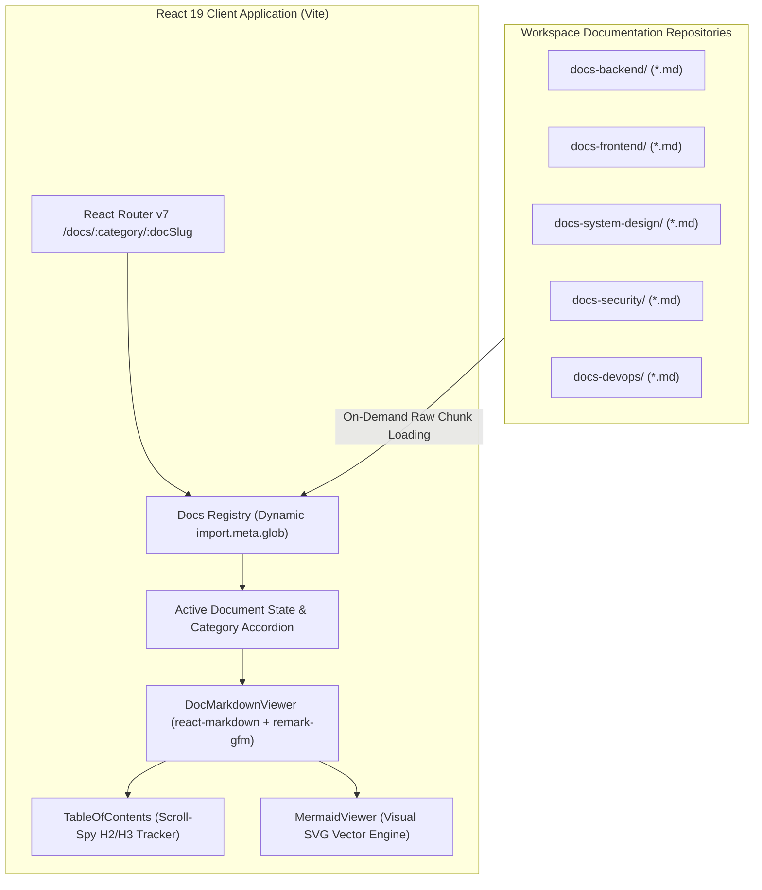

# 11 - In-App Documentation Hub, Dynamic Markdown Engine & Search Architecture in React 19

In enterprise platforms, documentation cannot live in isolated external wikis or siloed PDFs that quickly drift out of date. Embedding an interactive, searchable **Documentation Hub directly within the React 19 frontend application** empowers developers, QA engineers, and system administrators to read, search, and copy code examples directly inside their workflow.

This guide details the architectural design and implementation of our high-performance in-app Documentation Hub powered by **React 19**, **Vite Raw Glob Imports**, **React Markdown**, **remark-gfm**, **Scroll-Spy Table of Contents**, and **Sub-Second Search Indexing**.

---

## 1. Architectural Overview: Static Site Generators vs Embedded In-App Docs



### Why Embed Docs in the Core React Application?

| Feature | External Static Site (Docusaurus / GitBook) | Embedded React 19 In-App Documentation Hub |
| :--- | :--- | :--- |
| **Authentication & RBAC** | Requires external SSO / OAuth proxy | Uses in-app JWT session and dynamic permission gates (`<PermissionGate />`) |
| **Deployment Complexity** | Separate hosting, domains, CI/CD pipelines | Zero extra infrastructure; bundled directly with Vite |
| **Component Interactivity** | Static or limited iframe widgets | Full React 19 component execution, live interactive Mermaid charts, copy actions |
| **Theme Synchronicity** | Separate theme states | Seamless 1-to-1 synchronization with app's Light, Dark, and System modes |
| **Build-Time Memory** | Duplicates CSS / UI component bundles | Reuses existing shadcn/ui, Lucide icons, and Tailwind CSS v4 design tokens |

---

## 2. Dynamic Documentation Registry & On-Demand Raw Glob Loading

Instead of hardcoding 100+ document routes or loading megabytes of markdown on initial application boot, Vite provides `import.meta.glob` with `{ query: '?raw', import: 'default' }`. This creates **lazy async chunk loaders** that fetch raw markdown strings on demand.

### `client/src/features/docs/data/docsRegistry.ts`

```typescript
// Lazy dynamic glob import for all documentation suites across the enterprise repo
export const docModules = import.meta.glob<string>(
  '../../../../../docs-*/**/*.md',
  { query: '?raw', import: 'default' }
)

export interface DocItem {
  id: string
  title: string
  category: string
  categoryName: string
  slug: string
  path: string
}

export interface DocCategory {
  id: string
  name: string
  icon: string
  docs: DocItem[]
}

export function parseDocsRegistry(): DocCategory[] {
  const categoryMap = new Map<string, DocCategory>()

  for (const path of Object.keys(docModules)) {
    const match = path.match(/docs-([^/]+)\/(.+)\.md$/)
    if (!match) continue

    const categoryId = match[1]
    const filename = match[2]
    const title = formatDocTitle(filename)
    const slug = filename.toLowerCase()

    if (!categoryMap.has(categoryId)) {
      categoryMap.set(categoryId, {
        id: categoryId,
        name: formatCategoryName(categoryId),
        icon: getCategoryIcon(categoryId),
        docs: [],
      })
    }

    categoryMap.get(categoryId)!.docs.push({
      id: `${categoryId}-${slug}`,
      title,
      category: categoryId,
      categoryName: formatCategoryName(categoryId),
      slug,
      path,
    })
  }

  return Array.from(categoryMap.values())
}
```

---

## 3. Custom Markdown AST Renderer & GitHub Alerts

Using `react-markdown` and `remark-gfm`, markdown syntax is parsed into an Abstract Syntax Tree (AST). Custom React components replace default HTML elements with elevated, styled equivalents:

### 1. GitHub-Flavored Callout Alerts

GitHub alerts (`[!NOTE]`, `[!TIP]`, `[!IMPORTANT]`, `[!WARNING]`, `[!CAUTION]`) are parsed from standard blockquotes and rendered with dedicated colors and icons:

```tsx
// Blockquote custom component supporting GitHub callouts
blockquote({ children }) {
  const text = String(children)

  if (text.includes('[!NOTE]')) {
    return <AlertBanner type="note">{children}</AlertBanner>
  }
  if (text.includes('[!TIP]')) {
    return <AlertBanner type="tip">{children}</AlertBanner>
  }
  if (text.includes('[!IMPORTANT]')) {
    return <AlertBanner type="important">{children}</AlertBanner>
  }
  if (text.includes('[!WARNING]')) {
    return <AlertBanner type="warning">{children}</AlertBanner>
  }
  if (text.includes('[!CAUTION]')) {
    return <AlertBanner type="caution">{children}</AlertBanner>
  }

  return (
    <blockquote className="border-l-4 border-blue-500 bg-blue-50/50 dark:bg-blue-950/30 pl-5 py-3 my-5 rounded-r text-slate-700 dark:text-slate-300 italic">
      {children}
    </blockquote>
  )
}
```

### 2. Auto-Anchor Headings

Headings automatically generate URL-friendly slug IDs (`#heading-slug`) so users can click on headers to deep-link directly to that section:

```tsx
h2({ children }) {
  const id = slugify(String(children))
  return (
    <h2 id={id} className="text-2xl sm:text-3xl font-bold pb-2 mt-10 mb-4 border-b border-slate-200 dark:border-slate-800 flex items-center group">
      <a href={`#${id}`} className="hover:underline text-slate-900 dark:text-slate-100">
        {children}
      </a>
    </h2>
  )
}
```

---

## 4. Scroll-Spy Table of Contents (`TableOfContents.tsx`)

The Table of Contents scans the markdown content for `##` (H2) and `###` (H3) headers and listens to window scroll positions using a throttled Scroll-Spy listener:

```typescript
// Scroll-Spy active heading tracker
useEffect(() => {
  const handleScroll = () => {
    const headingElements = headings.map((h) => document.getElementById(h.id)).filter(Boolean)
    const scrollPosition = window.scrollY + 140

    for (let i = headingElements.length - 1; i >= 0; i--) {
      const el = headingElements[i]
      if (el && el.offsetTop <= scrollPosition) {
        setActiveId(el.id)
        break
      }
    }
  }

  window.addEventListener('scroll', handleScroll, { passive: true })
  return () => window.removeEventListener('scroll', handleScroll)
}, [headings])
```

---

## 5. Summary & Best Practices

1. **Lazy Markdown Splitting**: Never bundle 100+ raw markdown files into the main JS chunk. Utilize Vite raw glob dynamic imports to split each guide into its own lightweight chunk (<15 kB).
2. **Safe Heading Slugification**: Sanitize non-alphanumeric characters, strip leading/trailing hyphens, and ensure unique anchor IDs across the document.
3. **Reading Time Estimation**: Calculate words dynamically (`Math.ceil(words / 200)`) to provide accurate reading estimates for complex architectural guides.
4. **Accessible Keyboard Navigation**: Support `Esc` dismissals and auto-scroll behaviors on guide navigation.
