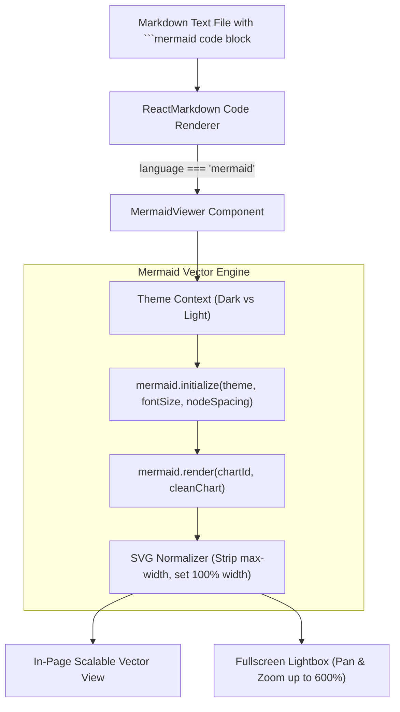

# 12 - Interactive Mermaid Vector Diagram Rendering & Fullscreen Lightbox in React 19

Visual architecture diagrams (C4 models, sequence diagrams, state transitions, ER entity models, and distributed network graphs) communicate complex domain logic far more effectively than wall-to-wall text. In markdown documents, diagrams are written as ` ```mermaid ` text blocks.

This document details the frontend implementation of our dynamic **Mermaid Vector SVG Rendering Engine**, **Automatic SVG Normalization**, **Dark/Light Theme Synchronization**, and **Pan-and-Zoom Fullscreen Lightbox Modal** in React 19.

---

## 1. Architectural Overview: Static Images vs Dynamic Vector SVGs



---

## 2. Dynamic Mermaid Engine Integration (`MermaidViewer.tsx`)

### 1. Theme-Synchronized Initialization

When users toggle between Dark Mode and Light Mode, the Mermaid library is dynamically re-initialized with optimized color palettes:

```typescript
mermaid.initialize({
  startOnLoad: false,
  theme: isDark ? 'dark' : 'neutral',
  securityLevel: 'loose',
  fontFamily: 'ui-sans-serif, system-ui, -apple-system, BlinkMacSystemFont, "Segoe UI", Roboto, sans-serif',
  fontSize: 18,
  flowchart: {
    useMaxWidth: false,
    htmlLabels: true,
    curve: 'basis',
    nodeSpacing: 60,
    rankSpacing: 60,
    padding: 24,
  },
  themeVariables: isDark
    ? {
        darkMode: true,
        fontSize: '18px',
        background: '#0f172a',
        primaryColor: '#312e81',
        primaryTextColor: '#e0e7ff',
        primaryBorderColor: '#818cf8',
        lineColor: '#94a3b8',
        secondaryColor: '#1e293b',
        tertiaryColor: '#0f172a',
      }
    : {
        darkMode: false,
        fontSize: '18px',
        background: '#ffffff',
        primaryColor: '#e0e7ff',
        primaryTextColor: '#1e1b4b',
        primaryBorderColor: '#6366f1',
        lineColor: '#64748b',
        secondaryColor: '#f1f5f9',
        tertiaryColor: '#ffffff',
      },
})
```

---

## 3. Solving the Small SVG Scaling Issue (Automatic Normalization)

By default, Mermaid generates SVG elements with hardcoded inline constraints (such as `style="max-width: 420px;"`), which causes diagrams to appear tiny on high-resolution 2K/4K monitors.

We normalize the generated SVG string before rendering:

```typescript
mermaid
  .render(chartId, cleanChart)
  .then(({ svg }) => {
    // Strip restricting inline max-width attributes and set responsive full-width styling
    const normalizedSvg = svg
      .replace(/style="max-width:\s*[^;"]+;?"/gi, 'style="width: 100%; height: auto; max-width: 100%;"')
      .replace(/max-width:\s*\d+(\.\d+)?px;?/gi, '')

    setSvgHtml(normalizedSvg)
    setLoading(false)
  })
```

---

## 4. Fullscreen Interactive Lightbox & Pan/Zoom Controls

For extensive architecture workflows (such as 10-level workflow state machines or distributed database topologies), the in-page container might not provide enough vertical height.

The **Fullscreen Lightbox Modal** allows users to:

1. Zoom seamlessly from **`40%` up to `600%`** using the toolbar buttons, mouse wheel, or pinch gestures.
2. Click and drag (`cursor-grab` ➔ `cursor-grabbing`) to pan across large flowcharts.
3. Reset position and zoom back to 100% with a single click.
4. Exit via the `Esc` key or close button.

### Pan & Drag State Machine Implementation

```typescript
const [panPosition, setPanPosition] = useState<{ x: number; y: number }>({ x: 0, y: 0 })
const [isDragging, setIsDragging] = useState<boolean>(false)
const dragStartRef = useRef<{ x: number; y: number }>({ x: 0, y: 0 })

const handleMouseDown = useCallback((e: React.MouseEvent) => {
  setIsDragging(true)
  dragStartRef.current = {
    x: e.clientX - panPosition.x,
    y: e.clientY - panPosition.y,
  }
}, [panPosition])

const handleMouseMove = useCallback((e: React.MouseEvent) => {
  if (!isDragging) return
  setPanPosition({
    x: e.clientX - dragStartRef.current.x,
    y: e.clientY - dragStartRef.current.y,
  })
}, [isDragging])

const handleWheel = useCallback((e: React.WheelEvent) => {
  e.preventDefault()
  const delta = e.deltaY < 0 ? 0.2 : -0.2
  setZoomLevel((prev) => Math.min(Math.max(prev + delta, 0.4), 6.0))
}, [])
```

---

## 5. Summary & Key Takeaways

| Requirement | Implementation Solution |
| :--- | :--- |
| **Vector Sharpness** | Pure SVG generation; lossless scaling across all DPIs |
| **Dark Theme Sync** | Re-renders SVG with dark theme palette when `resolvedTheme` changes |
| **Wide Screen Readability** | SVG normalization removes `max-width: 400px` limitation |
| **Intricate Architecture Exploration** | Fullscreen Lightbox Modal with 600% zoom and mouse drag-to-pan |
| **Syntax Error Resilience** | Catches compilation errors and presents a diagnostic fallback with raw code |
