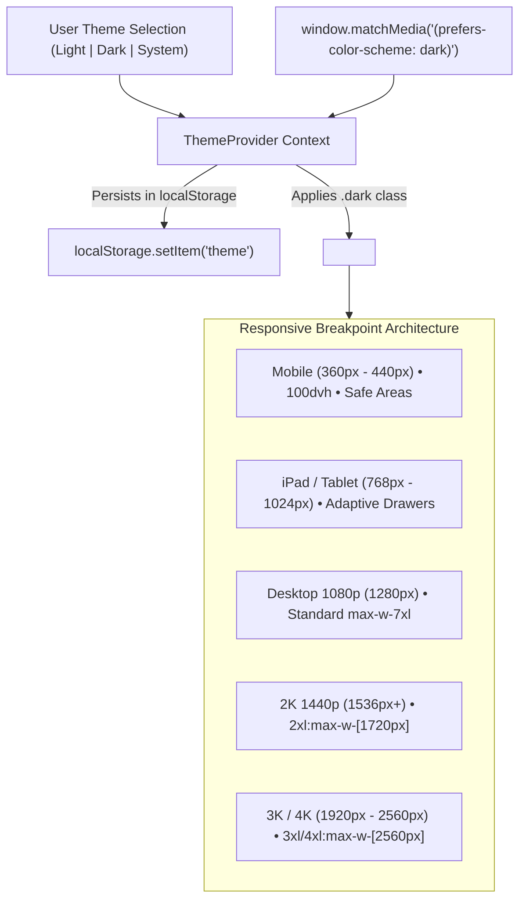

# 13 - Enterprise Dark/Light Theming, HiDPI 2K/4K Scaling & Flagship Mobile Optimization

Enterprise web applications are accessed across a wide range of display form factors: from **ultra-wide 2K/4K desktop monitors** and **iPads in split-view** to **flagship high-density mobile devices** like the **iPhone 17 Pro Max** and **Samsung S26 Ultra**.

This document outlines the architecture for our **Zero-CLS Theme Engine (Light / Dark / System Preference)**, **Tailwind CSS v4 `@theme` Custom Breakpoints**, **Dynamic Viewport Height (`100dvh`)**, and **Interactive Font Scaling System** in React 19.

---

## 1. Architectural Overview: Multi-Tier Display & Theme Matrix



---

## 2. Zero-CLS Theme Provider (`ThemeProvider.tsx` & `ThemeToggle.tsx`)

A common mistake in React theming is visual flash (Flash of Unstyled Theme / CLS) where the screen briefly flashes white before applying dark mode.

### `ThemeProvider.tsx`

```typescript
export type Theme = 'light' | 'dark' | 'system'

export function ThemeProvider({
  children,
  defaultTheme = 'system',
  storageKey = 'clean-arch-theme',
}: ThemeProviderProps) {
  const [theme, setTheme] = useState<Theme>(() => {
    return (localStorage.getItem(storageKey) as Theme) || defaultTheme
  })

  const [resolvedTheme, setResolvedTheme] = useState<'light' | 'dark'>('light')

  useEffect(() => {
    const root = window.document.documentElement
    const mediaQuery = window.matchMedia('(prefers-color-scheme: dark)')

    const applyTheme = (currentTheme: Theme) => {
      root.classList.remove('light', 'dark')

      let effectiveTheme: 'light' | 'dark'
      if (currentTheme === 'system') {
        effectiveTheme = mediaQuery.matches ? 'dark' : 'light'
      } else {
        effectiveTheme = currentTheme
      }

      root.classList.add(effectiveTheme)
      setResolvedTheme(effectiveTheme)
    }

    applyTheme(theme)

    const handleMediaChange = () => {
      if (theme === 'system') applyTheme('system')
    }

    mediaQuery.addEventListener('change', handleMediaChange)
    return () => mediaQuery.removeEventListener('change', handleMediaChange)
  }, [theme])

  // Context value with toggle and explicit set
  const value = {
    theme,
    resolvedTheme,
    setTheme: (newTheme: Theme) => {
      localStorage.setItem(storageKey, newTheme)
      setTheme(newTheme)
    },
    toggleTheme: () => {
      const nextTheme = resolvedTheme === 'dark' ? 'light' : 'dark'
      localStorage.setItem(storageKey, nextTheme)
      setTheme(nextTheme)
    },
  }

  return (
    <ThemeProviderContext.Provider value={value}>
      {children}
    </ThemeProviderContext.Provider>
  )
}
```

---

## 3. Tailwind CSS v4 Theme Breakpoints & HiDPI 2K/4K Scaling

Standard Tailwind `2xl` caps out at 1536px. On 2K (2560x1440) and 4K (3840x2160) monitors, fixed `max-w-7xl` (1280px) containers waste over 50% of screen real estate.

In `client/src/index.css`, we configure custom breakpoints in the Tailwind v4 `@theme` block:

```css
@theme {
  --breakpoint-2xl: 1536px;
  --breakpoint-3xl: 1920px; /* Full HD Ultrawide / 1440p */
  --breakpoint-4xl: 2560px; /* 2K QHD / 4K UHD */
}
```

### Fluid Container Scaling Progression

```html
<main class="flex-1 max-w-7xl 2xl:max-w-[1720px] 3xl:max-w-[2100px] 4xl:max-w-[2560px] w-full mx-auto px-4 sm:px-6 lg:px-8 2xl:px-12 3xl:px-16 4xl:px-20 py-6 2xl:py-10">
  <!-- Content expands proportionally without awkward side gaps -->
</main>
```

---

## 4. Flagship Mobile Ergonomics (iPhone 17 Pro Max, Samsung S26 Ultra & iPad)

### 1. Viewport Fit & Safe-Area Insets

Configured `viewport-fit=cover` in `index.html` and safe-area padding in `index.css`:

```css
body {
  min-height: 100vh;
  min-height: 100dvh; /* Eliminates mobile address bar jump */
  padding-top: env(safe-area-inset-top, 0px);    /* Dynamic Island safe margin */
  padding-bottom: env(safe-area-inset-bottom, 0px); /* Home bar indicator */
  padding-left: env(safe-area-inset-left, 0px);
  padding-right: env(safe-area-inset-right, 0px);
}
```

### 2. 44px Minimum Touch Targets & Slide-Over Drawers

Adhering to Apple Human Interface Guidelines and Material Design 3, all interactive buttons, accordion toggles, and sidebar navigation links maintain a minimum height of **44px** with clear visual feedback.

---

## 5. Interactive Font Scaling (`A` / `A+` / `A++`)

To accommodate varying visual needs and viewing distances:

| Scale Mode | Multiplier | Recommended Display |
| :--- | :--- | :--- |
| **`A` (Standard)** | `100%` | Standard 1080p laptop / desktop |
| **`A+` (Comfortable)** | `125%` | 2K 1440p displays / Retina tablets |
| **`A++` (Large)** | `150%` | 4K UHD displays / Low-vision accessibility |

The active scale is stored in `localStorage` and applied across all markdown body text, headings, code blocks, and tables.
