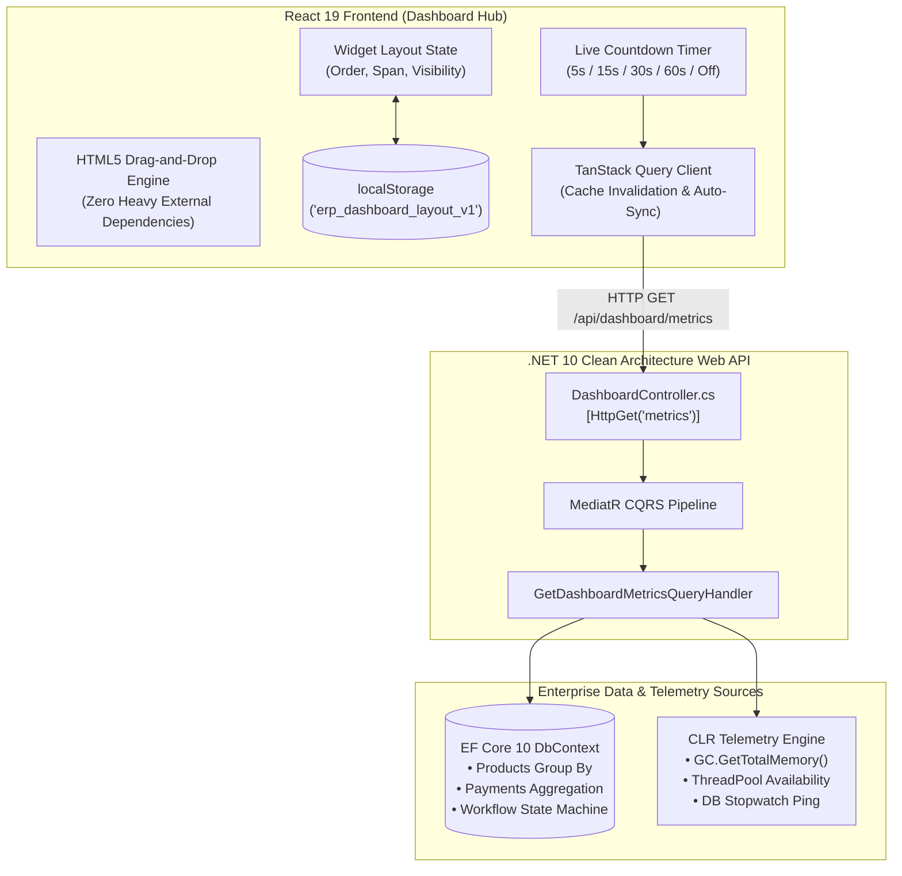

# Enterprise ERP Dashboard Architecture with Dynamic Drag-and-Drop Grid & Telemetry

This guide provides an in-depth architectural breakdown of building a high-performance **Enterprise ERP Executive Dashboard** in **React 19**, featuring a dynamic drag-and-drop grid, responsive widget resizing, local storage layout persistence, auto-refresh telemetry, and Clean Architecture backend integration.

---

## 1. Executive Dashboard Architecture Overview

Modern enterprise applications require high-density, customizable executive dashboards that aggregate mission-critical KPIs, real-time telemetry, operational queues, and financial transactions into an intuitive, responsive interface.



---

## 2. Dynamic Drag-and-Drop & Resizing Engine

Rather than bundling bulky legacy drag-and-drop libraries, we utilize the native **HTML5 Drag and Drop API** paired with React 19's declarative state management for zero bundle overhead and 60fps fluidity.

### Widget Configuration Schema

```typescript
export type WidgetSpan = '1' | '2' | '3' | 'full'

export interface DashboardWidgetConfig {
  id: string
  title: string
  category: 'kpi' | 'charts' | 'operations' | 'system'
  span: WidgetSpan
  visible: boolean
  order: number
}
```

### Drag-and-Drop Handlers with Array Reordering

```typescript
const handleDragStart = (id: string) => {
  setDraggedWidgetId(id)
}

const handleDragOver = (e: React.DragEvent, targetId: string) => {
  e.preventDefault()
  if (!draggedWidgetId || draggedWidgetId === targetId) return

  const updated = [...widgets]
  const sourceIdx = updated.findIndex((w) => w.id === draggedWidgetId)
  const targetIdx = updated.findIndex((w) => w.id === targetId)

  if (sourceIdx !== -1 && targetIdx !== -1) {
    const [removed] = updated.splice(sourceIdx, 1)
    updated.splice(targetIdx, 0, removed)
    // Re-assign 0-indexed order
    updated.forEach((w, i) => {
      w.order = i
    })
    setWidgets(updated)
  }
}

const handleDragEnd = () => {
  setDraggedWidgetId(null)
}
```

> [!TIP]
> Native HTML5 `onDragOver` requires `e.preventDefault()` to signal that the drop target is active. Using smooth CSS transforms (`transition-all duration-200`) ensures widgets glide into place without screen flicker.

---

## 3. Responsive Column Span Calculation

Tailwind CSS grid spans dynamically adapt across viewport breakpoints from mobile screens to massive HiDPI 4K displays:

```typescript
const getColSpanClass = (span: WidgetSpan) => {
  switch (span) {
    case '1':
      return 'col-span-1 lg:col-span-1'
    case '2':
      return 'col-span-1 lg:col-span-2'
    case '3':
      return 'col-span-1 lg:col-span-2 2xl:col-span-3'
    case 'full':
    default:
      return 'col-span-1 lg:col-span-2 2xl:col-span-3 3xl:col-span-4'
  }
}
```

---

## 4. Automatic LocalStorage Synchronization & Recovery

Executive preferences (widget visibility, ordering, column widths) are automatically persisted across browser sessions with a built-in fallback and reset action:

```typescript
// Initial state hydration with fallback
const [widgets, setWidgets] = useState<DashboardWidgetConfig[]>(() => {
  try {
    const saved = localStorage.getItem('erp_dashboard_layout_v1')
    if (saved) {
      const parsed = JSON.parse(saved)
      if (Array.isArray(parsed) && parsed.length > 0) return parsed
    }
  } catch {
    // Fallback to default ERP layout on parse error
  }
  return DEFAULT_WIDGETS
})

// Auto-save on any layout mutation
useEffect(() => {
  try {
    localStorage.setItem('erp_dashboard_layout_v1', JSON.stringify(widgets))
  } catch {
    // Storage quota handled gracefully
  }
}, [widgets])

const handleResetLayout = () => {
  setWidgets(DEFAULT_WIDGETS)
  localStorage.removeItem('erp_dashboard_layout_v1')
}
```

---

## 5. Live Auto-Sync Countdown & Invalidation

The dashboard supports configurable real-time polling with an interactive countdown bar and manual on-demand refresh:

```typescript
// Auto-refresh interval countdown timer
useEffect(() => {
  if (refreshInterval === 0) return

  const timer = setInterval(() => {
    setCountdown((prev) => {
      if (prev <= 1) {
        handleManualRefresh()
        return refreshInterval
      }
      return prev - 1
    })
  }, 1000)

  return () => clearInterval(timer)
}, [refreshInterval, handleManualRefresh])

const handleManualRefresh = useCallback(async () => {
  setIsRefreshing(true)
  // Invalidate TanStack Query to trigger fresh backend telemetry fetch
  await queryClient.invalidateQueries({ queryKey: ['dashboardMetrics'] })
  setCountdown(refreshInterval)
  setTimeout(() => setIsRefreshing(false), 600)
}, [queryClient, refreshInterval])
```

---

## 6. Real-Time Telemetry & Metric Consumption

```typescript
// Live Clean Architecture Backend Query
const { data: backendResponse, isLoading } = useQuery({
  queryKey: ['dashboardMetrics', period],
  queryFn: () => dashboardApi.getMetrics(period),
})

const metricsData = backendResponse?.data
```

The metrics are then cleanly decomposed into dedicated, reusable widgets:

- `DashboardKpiCard`: Executive financial and operational summary cards.
- `RevenueVelocityChart`: SVG bar and area chart visualizing financial trends.
- `CategoryDistributionChart`: Catalog stock utilization and SKU share.
- `CacheEfficiencyWidget`: OutputCache vs. IMemoryCache vs. EF Core latency breakdown.
- `WorkflowVelocityWidget`: Approval pipeline bottleneck monitoring.
- `SystemHealthWidget`: Live Kestrel, EF Core, and GC telemetry.
- `RecentActivityWidget`: Live audit stream of system events.
- `QuickActionsWidget`: Fast shortcuts for high-frequency ERP operations.

---

## 7. Summary & Architectural Benefits

- **Zero Heavy Dependencies**: Pure React 19 and native HTML5 Drag and Drop engine.
- **Enterprise-Grade Visuals**: High contrast in Light Mode and deep slate-900 in Dark Mode.
- **Real-Time Synchronized**: Automatic background polling with seconds countdown and instant manual refresh.
- **Fault-Tolerant Layout Persistence**: Saved in `localStorage` with one-click restore.
