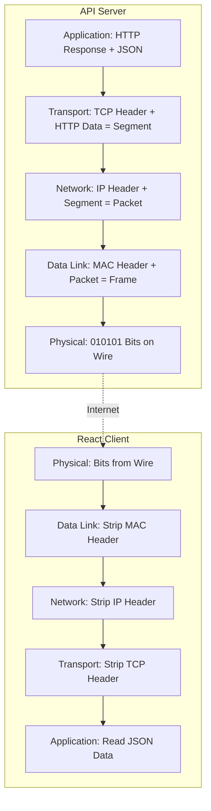

# Module 01: The OSI Model and TCP/IP Suite

Understanding how data travels from a physical cable up to a web browser is fundamental for diagnosing performance issues, configuring firewalls, and designing distributed systems.

---

## 📚 1. The OSI 7-Layer Model

The Open Systems Interconnection (OSI) model conceptualizes network communication into 7 distinct layers.

| Layer | Name | Function | Data Unit | Protocols & Devices |
| :---: | :--- | :--- | :--- | :--- |
| **7** | **Application** | Network access for the application | Data | HTTP, HTTPS, FTP, SMTP, DNS, SSH |
| **6** | **Presentation** | Data formatting, encryption, compression | Data | TLS/SSL, JPEG, ASCII, JSON |
| **5** | **Session** | Establishing, maintaining, and terminating sessions | Data | NetBIOS, RPC, Sockets |
| **4** | **Transport** | End-to-end connections, reliability, flow control | **Segment** / Datagram | TCP, UDP |
| **3** | **Network** | Routing across networks, logical addressing | **Packet** | IP, ICMP (Ping), IPSec, Routers |
| **2** | **Data Link** | Node-to-node data transfer, MAC addressing | **Frame** | Ethernet, Wi-Fi (802.11), Switches |
| **1** | **Physical** | Physical transmission of raw bits | **Bit** | Cables (Cat6, Fiber), Hubs, Radio waves |

---

## 🌐 2. The TCP/IP Suite (DoD Model)

In practice, the modern internet runs on the **TCP/IP model**, which collapses the OSI model into 4 layers:

1. **Application Layer** (OSI 5, 6, 7): HTTP, DNS, TLS
2. **Transport Layer** (OSI 4): TCP, UDP
3. **Internet Layer** (OSI 3): IPv4, IPv6
4. **Network Access Layer** (OSI 1, 2): Ethernet, MAC addresses

---

## 📦 3. Data Encapsulation & Decapsulation

When a .NET Web API sends a JSON response to a React client, the data is encapsulated at every layer down the stack.

### The Encapsulation Process:

1. **Payload**: The JSON string `{"status": "ok"}`.
2. **HTTP Header (L7)**: Adds `Content-Type: application/json` and status `200 OK`.
3. **TCP Header (L4)**: Adds Source Port (8080) and Destination Port (50341). Data becomes a **Segment**.
4. **IP Header (L3)**: Adds Source IP (`10.0.0.5`) and Destination IP (`203.0.113.1`). Segment becomes a **Packet**.
5. **Ethernet Header (L2)**: Adds Source MAC Address and Destination MAC Address of the next router hop. Packet becomes a **Frame**.
