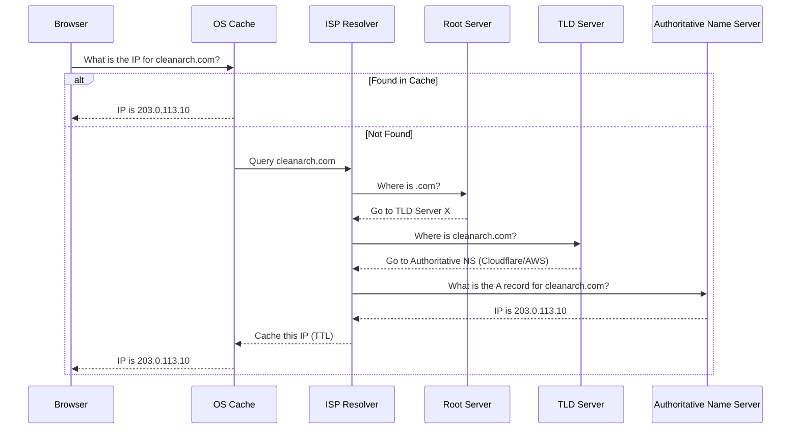

# Module 02: DNS Resolution and Record Types

The Domain Name System (DNS) is the phonebook of the internet, translating human-readable domains (like `google.com`) into machine-readable IP addresses (like `142.250.190.46`).

---

## 🔍 1. The DNS Resolution Process

When a user types `cleanarch.com` into their browser, the following lookup sequence occurs:



---

## 📋 2. Common DNS Record Types

When configuring a domain for a web application, you will manage these records in your DNS provider (e.g., Cloudflare, AWS Route 53, GoDaddy).

| Record Type | Name | Purpose | Example Value |
| :--- | :--- | :--- | :--- |
| **A** | Address Record | Maps a domain to an **IPv4** address. | `203.0.113.10` |
| **AAAA** | IPv6 Address | Maps a domain to an **IPv6** address. | `2001:0db8:85a3::8a2e` |
| **CNAME** | Canonical Name | Maps an alias to another domain name (never an IP). Useful for subdomains pointing to PaaS like Azure. | `webapp.azurewebsites.net` |
| **TXT** | Text Record | Arbitrary text. Used heavily for domain verification, SPF, and DKIM (email security). | `google-site-verification=abc123...` |
| **MX** | Mail Exchange | Directs emails to a mail server. Includes a priority number. | `10 alt1.aspmx.l.google.com` |
| **NS** | Name Server | Delegates a DNS zone to a specific authoritative name server. | `ns1.cloudflare.com` |

---

## ⏱️ 3. Time To Live (TTL)

**TTL** dictates how long a DNS record is cached by ISP resolvers and browsers before they must query the authoritative server again.

- **High TTL (e.g., 24 hours / 86400s)**: Good for stable domains. Reduces DNS query load.
- **Low TTL (e.g., 1 minute / 60s)**: Crucial when planning a server migration or failover, allowing rapid propagation of the new IP address.

> [!WARNING]  
> If you are migrating a production server to a new IP, lower the TTL to 60 seconds at least 24 hours **before** the migration to ensure caches expire quickly.

---

## 🛠️ 4. DNS Troubleshooting Tools

**Check an A Record:**

```bash
# Windows
Resolve-DnsName google.com

# Linux/macOS
dig google.com A
```

**Trace the entire DNS delegation path:**

```bash
dig +trace google.com
```

**Clear Local DNS Cache (Windows):**

```powershell
ipconfig /flushdns
```
